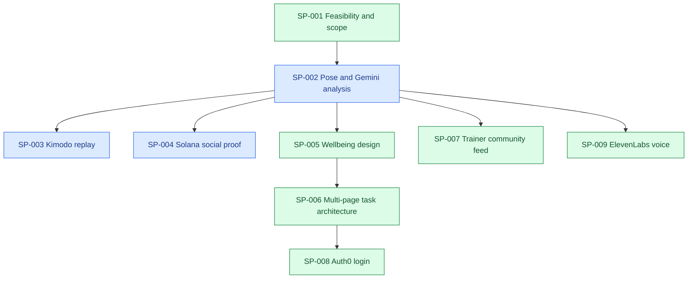

# Project Ledger

## Resume Here

Canonical repository: **https://github.com/SafwanKamal/FormChain.git** (user-owned). All future work targets this origin. Local path remains `/Users/safwankamal/Documents/HackwestTX`. Earlier branch and remote entries below are historical.

| Field                      | Last observed state                                                                                                                                                                                                 |
| -------------------------- | ------------------------------------------------------------------------------------------------------------------------------------------------------------------------------------------------------------------- |
| Project goal               | Build a hackathon prototype that reviews gym exercise video, teaches through a trainer community, replays motion, and records optional Solana receipts.                                                             |
| Current phase              | Local-first multi-route MVP (Analyze / Replay / Community / Profile; rewards nested under Profile) with automatic five-exercise upload analysis, live camera coaching, and ElevenLabs spoken cues. Theme redesign may still be concurrent. |
| Branch / commit | `main` reinitialized from the published project snapshot with SafwanKamal-linked author identity; canonical origin `https://github.com/SafwanKamal/FormChain.git`. Old history retained only in a local backup branch. Concurrent competition/UI edits remain uncommitted. |
| Active primary sub-problem | SP-004 — Solana product-case assessment (planned only); concurrent SP-003 Kimodo work preserved |
| Last validated milestone | Warm Kimodo ~3s uncached. Push-up/plank prompts rewritten for visible arm travel; cache keys hash prompt text so old flat clips are skipped. |
| Current blocker or risk | New push-up / plank up-down clips still need one live Generate each to confirm Kimodo follows the stronger prompts. After worker restart, preload takes ~1–2 min. |
| Exact next action | Proposed: scope one devnet sponsor-funded challenge with on-chain budget, issuer authorization and single-use claims; not yet selected or implemented. Concurrent Replay follow-up remains below. |
| Most relevant prior chat   | Unavailable from current surface                                                                                                                                       |
| Ledger updated | 2026-09-13T08:37:17-05:00 |

## Status Legend

| Status        | Meaning                                  | Color  |
| ------------- | ---------------------------------------- | ------ |
| ✅ COMPLETE   | Acceptance criteria verified             | Green  |
| 🔵 ACTIVE     | Work currently in progress               | Blue   |
| 🟡 READY NEXT | Prerequisites satisfied                  | Yellow |
| 🟠 BLOCKED    | Cannot proceed until a condition changes | Orange |
| ⚪ DEFERRED   | Intentionally postponed                  | Gray   |
| ❌ SUPERSEDED | Replaced or abandoned                    | Red    |

## Project Goal and Scope

The proposed project, provisionally named FormChain, analyzes a short single-person gym video, identifies the exercise and repetitions, scores observable biomechanics, explains corrections, generates a canonical 3D motion replay, and writes a workout proof/reward interaction to Solana devnet. The HackWesTX VII brief supplied by the user is the authoritative event source. Medical diagnosis, injury clearance, physique/attractiveness scoring, production anti-cheat, and faithful single-camera 3D reconstruction are out of scope for the hackathon MVP.

## Working Architecture

### System Architecture

Current: Next.js 16.3.5 / React 19 with a shared shell and five primary destinations: `/` home dashboard (session history + weekly goal), `/analyze` automatic five-exercise upload analysis plus live camera, `/replay` Kimodo/BVH playback, `/social` trainer community demo, and `/profile` local user details/storage metadata. `/profile/rewards` nests points and optional receipts; `/rewards` redirects there. Analyze no longer exposes five separate exercise tabs: uploaded clips are classified and routed automatically, while live camera uses one compact exercise selector because live classification is not implemented. Social uses a persistent participation leaderboard alongside fictional seed posts and browser-local upvotes. Latest analysis persists in tab-scoped session storage; up to 30 history entries persist in localStorage; video/keyframes do not. Dashboard reflections show reps/duration instead of reward points. Profile display name and descriptive training focus persist under `formchain.profile.v1`. Optional Auth0 Universal Login identifies the account at `/sign-in` and `/sign-up`; local details, history, and video remain on-device. Local development currently sets `AUTH_DISABLED=true`, which renders the app and gated APIs as a stand-in Dev Mode user. Live Gemini coaching is verified for squat. Live camera speaks short local cues through ElevenLabs Flash v2.5 via `/api/speak` (text only, no video). Kimodo still needs NVIDIA; no live workout receipt or production reward has been issued.

Target architecture (step 4 is adapter-complete but not live-model-verified; step 5 is self-claim-complete but not live-wallet-verified):

1. Browser captures or uploads a short clip.
2. A local pose landmarker processes frames at useful exercise cadence and computes joint angles, rep phases, visibility, and candidate keyframes.
3. Gemini receives sampled frames plus pose metrics and returns structured exercise classification, coaching cues, and a form score with confidence.
4. A GPU-side Kimodo adapter turns the exercise description and selected pose constraints into a canonical motion file for 3D playback; a prerecorded fallback protects the demo.
5. Live camera sessions collect capped, authenticated, self-reported participation points in `.data/rewards.sqlite`. Uploaded clips and samples cannot claim. A unique account + summary digest prevents identical repeat claims; an immediate SQLite transaction enforces the UTC daily cap. No private video or landmarks are persisted by this service.
6. Community and Rewards share account aliases, period/exercise filters, search, tie ranks, pagination, own-rank statistics, and recent point history. Trainer posts/upvotes remain the separate local fictional feed.
7. Wallet UI builds an actual System Program transfer from the connected wallet, checks the devnet genesis hash, and requires wallet approval. It does not convert points into SOL. Local LiteSVM and public-devnet CLI transfers are verified (0.001 SOL recipient delta, Explorer-finalized). The in-app connected-wallet approval click-path was not re-run after funding. Public demo/proof server-signing routes return 410. Legacy issuer-protected attestation/redemption APIs remain a separate experimental protocol, not the participation leaderboard or a treasury payout system.

### Development Sequence

### Active Work Map

| Sub-problem | Status      | Branch / worktree                         | HEAD                    | Sessions     | Blocker / next action                                                        |
| ----------- | ----------- | ----------------------------------------- | ----------------------- | ------------ | ---------------------------------------------------------------------------- |
| SP-001      | ✅ COMPLETE | `codex/movement-review` / repository root | `7624389`               | Current task | Scope approved and implemented through the motion adapter                    |
| SP-002      | 🔵 ACTIVE   | `codex/movement-review` / repository root | `615a834` + uncommitted | Current task | Baseline stabilized (NEXT-009); move inference off main thread                |
| SP-003      | 🔵 ACTIVE   | `codex/movement-review` / repository root | `615a834` + uncommitted | Current task | Warm in-process gen verified ~3s; keep text encoder + preload; avoid CLI fallback |
| SP-004      | 🔵 ACTIVE   | `codex/movement-review` / repository root | `615a834` + uncommitted | Current task | Public-devnet CLI transfer verified; in-app wallet click-path and monetary rewards remain open |
| SP-006      | ✅ COMPLETE | `codex/movement-review` / repository root | `615a834` + uncommitted | Current task | Profile owns metadata and nested rewards; desktop/mobile navigation verified |
| SP-007      | ✅ COMPLETE | `codex/movement-review` / repository root | `615a834` + uncommitted | Current task | Live participation ranking added; trainer posts remain fictional and browser-local         |
| SP-008      | ✅ COMPLETE | `codex/movement-review` / repository root | `615a834` + uncommitted | Current task | Universal Login and signup verified on localhost; live account round-trip left to the user |
| SP-009      | ✅ COMPLETE | `codex/movement-review` / repository root | `615a834` + uncommitted | Current task | Live cue TTS verified; Gemini review speech is not wired |

## Sub-problem Index

| ID     | Title                            | Sequence | Status      | Upstream | Downstream             | Next action                                                   |
| ------ | -------------------------------- | -------: | ----------- | -------- | ---------------------- | ------------------------------------------------------------- |
| SP-001 | MVP architecture and feasibility |        1 | ✅ COMPLETE | None     | SP-002, SP-003, SP-004 | Scope accepted                                                |
| SP-002 | Pose and Gemini analysis         |        2 | 🔵 ACTIVE   | SP-001   | SP-003, SP-004         | Workerize inference and broaden clips                         |
| SP-003 | Kimodo canonical replay          |        3 | 🔵 ACTIVE   | SP-002   | Demo UI                | Confirm UI Generate feels fast; optional restart for warmup 503 guard |
| SP-004 | Solana workout proof and rewards |        3 | 🔵 ACTIVE   | SP-002   | Social feed            | Optional: confirm Rewards wallet UI with the funded key; monetary eligibility/treasury remain separate |
| SP-006 | Multi-page task architecture     |        4 | ✅ COMPLETE | SP-005   | Shared theme redesign  | Preserve route boundaries while applying the next theme       |
| SP-007 | Trainer community feed           |        5 | ✅ COMPLETE | SP-002   | Social backend         | Participation leaderboard verified; plan production publishing and moderation     |
| SP-008 | Auth0 login and signup           |        6 | ✅ COMPLETE | SP-006   | Social/rewards identity | Complete one live sign-in on localhost; keep app usable without an account |
| SP-009 | ElevenLabs coaching voice        |        7 | ✅ COMPLETE | SP-002   | Live camera demo        | Optional: speak post-set Gemini reviews |

## Sub-problems

### SP-001 — MVP architecture and feasibility

#### Goal and boundaries

Determine what can be demonstrated credibly within the hackathon and separate reliable scoring from generative replay and social rewards.

#### Dependencies and downstream impact

Defines the interfaces and fallback strategy for all implementation work.

#### Current state and acceptance criteria

- State: ✅ COMPLETE
- Evidence: Official Gemini, NVIDIA Kimodo, and Solana documentation inspected on 2026-09-12.
- Acceptance criteria: User approves a bounded MVP and its stated limitations. Met by "Ok. Proceed step by step."

#### Accumulated accomplishments

- Confirmed Gemini can analyze video and return timestamped/structured output, but default static processing is too sparse for exercise mechanics by itself.
- Confirmed Kimodo supports text and kinematic constraints and exports NPZ/BVH motion, but is a generator rather than raw-video mocap.
- Identified Solana devnet signed workout proof as the reliable first on-chain slice; SPL token economics and anti-cheat are follow-ups.
- A minimal Next.js scaffold was created before the user asked to pause at feasibility review. It remains uncommitted and contains no feature implementation.

#### Branches and worktrees

| Branch | Worktree                                  | Base commit | Last observed HEAD | State                |
| ------ | ----------------------------------------- | ----------- | ------------------ | -------------------- |
| `main` | `/Users/safwankamal/Documents/HackwestTX` | Unborn      | Unborn             | Uncommitted scaffold |

#### Chat sessions

| Session                          | Link | Started / updated       | Git state                  | Scope                               | Outcome                                 |
| -------------------------------- | ---- | ----------------------- | -------------------------- | ----------------------------------- | --------------------------------------- |
| Unavailable from current surface |      | 2026-09-12 / 2026-09-12 | Unborn `main`, uncommitted | Feasibility and initial orientation | Review completed; implementation paused |

#### Decisions

- Score observable movement quality and confidence, not whether a body looks "toned."
- Use deterministic pose geometry for joint mechanics; use Gemini for recognition, phase semantics, explanations, and structured coaching.
- Treat Kimodo output as a canonical/corrected replay, not proof that the model reconstructed the athlete exactly.
- Keep off-chain score calculation separate from the on-chain proof so private video never needs to be published.

#### Blockers and open questions

- Team size and available NVIDIA GPU hardware are unknown.
- The first supported exercise has not been chosen; squat is the recommended demo path.
- Actual SPL token minting versus non-transferable app points remains a product decision.

#### Future directions

- Add deadlift, bench press, overhead press, and lunge only after the squat pipeline is reliable.
- Add server-attested scores and anti-replay controls after the devnet proof demo.

### SP-002 — Pose and Gemini analysis

- Goal: A usable squat-only clip-to-review path with observable measurements and uncertainty.
- Dependencies: SP-001 accepted. Downstream: Kimodo needs pose/phase data; Solana needs a trustworthy result schema.
- State: 🔵 ACTIVE. The supplied real footage yields five reps, Lite is the selected local model, and Gemini 3.8 Flash has returned grounded structured cues from the start plus all five rep bottoms. Broader clip validation and worker isolation remain.
- Acceptance: the supplied labeled footage agrees with rep counts/phase timestamps and configured Gemini produces grounded structured cues. Met for the supplied clip; generalization and main-thread responsiveness remain outstanding.
- Files: `src/lib/analysis.ts`, `src/lib/video.ts`, `src/lib/coaching.ts`, `src/app/page.tsx`, `src/app/globals.css`, `src/app/layout.tsx`, `src/app/api/coach/route.ts`, `.env.example`, package/lock files, tests, Playwright config, README, ledger.
- Validation: Lite/Full/Heavy were benchmarked at 15 FPS on the supplied clip. Lite: 23.05 ms mean inference, 100% coverage, five reps, 0.002-second mean bottom error. Full: 29.56 ms, 100%, five, 0.027 seconds. Heavy: 85.67 ms, 83.7%, five, 0.015 seconds. A live six-frame Gemini 3.8 Flash request returned HTTP 200, `squat` with high confidence, two conservative cues, and two explicit camera/sampling limitations. Current software validation: 25 TypeScript tests, lint, production build, TypeScript, formatting, and the opt-in benchmark/smoke commands pass.
- Upload regression: opening a localhost-bound Next dev server through `127.0.0.1` blocked the development client bundle, leaving server-rendered controls visible but unhydrated. `allowedDevOrigins: ["127.0.0.1"]` restores client behavior without a UI change. New picker/drop coverage and the supplied-video five-rep browser flow both pass in Chrome. A stale generated `.next` cache was moved to a temporary backup before clean verification.
- Scoring decision: Explicit range-and-tempo rubric, not a calibrated form score. No frontal knee tracking or medical claims. Exercise is provisionally selected as squat; non-squat/uncertain Gemini response hides the UI score. Client measurements are not reward attestations.
- Data: Analysis is local and ephemeral. Gemini transmission only follows its button click; maximum six keyframes. JSON export includes image-space landmarks, not Kimodo-compatible 3D constraints.
- Limits: Browser main-thread inference yields between frames but may stutter; network needed for model assets. Only one clip has compared model variants. Only side-view input with one detected person is supported. Clip length is not gym attendance duration.
- Git: current implementation on `codex/movement-review` at `8366a79`; draft PR #1 tracks the branch.
- Session: [01a096d1-daa3-7c62-8353-be67a427c1a8](codex://threads/01a096d1-daa3-7c62-8353-be67a427c1a8), confirmed by the app open-panel response. Work observed 2026-09-12T13:37:10-05:00 through 2026-09-12T13:53:34-05:00. Primary SP-002; related SP-001. No real gym recording or API credentials were supplied.
- Local preview: development server running at http://127.0.0.1:3000; app browser open queued. GET /api/coach confirmed configured=false. Final lint/build passed after formatting; branch still main with no commits.
- Uncommitted expansion (observed 2026-09-12T21:11:15-05:00, not re-validated here): `src/lib/exercises/*` generalizes cyclic/hold detectors for squat, push-up, lunge, deadlift, and plank; `AnalyzeSwitcher` keeps original squat review as default and adds `ExerciseReview` + `LiveCameraCoach`; `/api/speak` proxies short cues to ElevenLabs when configured. Gemini coaching and Rewards/session proof remain squat-oriented per README.
- Analyze athlete UI (2026-09-13): classifier percent is hidden. Gemini now auto-runs after a real uploaded clip, with an insight-first prompt (compare reps, exercise-specific visual checklist, min 2 cues). Sample stays local-only. Live Gemini output on a real clip was not re-run in this session.
- Analyze progress (2026-09-13T05:55:00-05:00): replaced the native green `<progress>` with the shared sage panel, clay fill, display-face percent, and quiet Cancel. Status copy is "Preparing analysis…" / "Measuring movement…". Verified on the front-squat clip (busy state + Cancel) and the recognition sample. Uncommitted; no commit or push.
- Next action: workerize MediaPipe inference (NEXT-006), or upload a real clip and confirm the richer auto Gemini debrief.

### SP-005 — Wellbeing interface research and redesign

- State: ✅ COMPLETE for the requested implementation; user usability research remains future work.
- Evidence: researched NHS typography/content, Oura information architecture, Apple charts/CareKit, Google PAIR, and W3C contrast/target guidance; full cited report in `docs/health-product-design-research.md`.
- Implemented: warm light palette, readable hierarchy, video-led review, fixed-height portrait viewer, selected rep tabs/intervals, phase contact sheet, tracking coverage explanation, and removal of the prominent unvalidated score.
- SP-002 update: analyzed supplied 14.373152-second front-squat video. It has 100% landmark coverage. Original detector counted one rep; same measurements now yield five at 1.40, 4.20, 6.87, 9.67, and 12.67 seconds. Fixed depth/phase-duration gates caused the undercount. Counting now uses upright-relative excursion; depth and tempo are review metrics. Extracts keyframes for every detected rep.
- Regression: reduced angle trace in `tests/fixtures/front-squat-trace.json`; raw video and exported full landmarks stay outside Git. Browser test accepts SQUAT_CLIP path so no personal path is required in source.
- Validation: 10 unit tests, 4 browser workflows including the supplied video, lint/build pass; desktop/mobile screenshots inspected. Additional accessibility scan in progress before sync.
- Branch: `codex/movement-review`, preserving remote initial README history; origin `https://github.com/Mack-Kabir/HackWestx_26.git`. User explicitly requested repository synchronization.
- Session: [Current task](codex://threads/01a096d1-daa3-7c62-8353-be67a427c1a8), 2026-09-12. Related SP-002 and SP-003. Kimodo live-host question pending; Mac is arm64 and no nvidia-smi is installed.
- Next: finish GitHub checkpoint, then Kimodo service/viewer. No production fitness-accuracy claim.

### SP-006 — Multi-page task architecture

- Latest update (2026-09-13T07:15:00-05:00): Trainers full ranking (`Show more` → `/social/leaderboard?ranking=trainers`) now uses the shared athlete-style table via `TrainerLeaderboard` (Rank / Trainer / Upvotes / Tips / Specialty, tie ranks, search, stats). Wired through `CommunityRankings`. Browser + eslint verified. Uncommitted; no commit or push.
- Previous update (2026-09-13T06:50:00-05:00): Moved the Community athlete preview into the existing sidebar directly above the trainer preview. Both ranking cards now occupy one stack and share the exact same `RankingPreview` structure on desktop and mobile. Lint passes. Uncommitted; no commit or push.
- Previous update (2026-09-13T06:35:00-05:00): Removed the selected-exercise prefix from the Live camera section label; it is now simply “Live camera.” Browser-verified for the Lunge selection; lint passes. Uncommitted; no commit or push.
- Previous update (2026-09-13T06:30:00-05:00): Fixed Analyze toolbar placement: the upload/live mode switch always comes before the conditional live Exercise select, so it remains at the same left coordinate in both modes. Browser-verified (414px in upload and live); lint passes. Uncommitted; no commit or push.
- Previous update (2026-09-13T06:25:00-05:00): Community athlete and trainer rankings now share the `RankingPreview` card treatment, each with a Show more link. `/social/leaderboard?ranking=athletes|trainers` provides the respective full view. Browser-verified; lint passes. Full typecheck remains blocked by a pre-existing `GenericRep`/`RepSummary` mismatch in `exercise-review.tsx`. Uncommitted; no commit or push.
- Previous update (2026-09-13T06:20:00-05:00): Removed the redundant Community “Demo community content” notice and its unused CSS. Community page verified in the browser; the dedicated Playwright run is blocked because `AUTH0_SECRET` is unavailable to the test process. Uncommitted; no commit or push.
- Previous update (2026-09-13T06:15:00-05:00): Live/upload empty states use the 8/16px stack around the primary button. Removed the ranking UTC/alias footnote. Desktop + 390px. Uncommitted; no commit or push.
- Previous update (2026-09-13T06:10:00-05:00): Removed the desktop header label "LOCAL-FIRST MOVEMENT TOOLS" and its unused CSS. Overview and Analyze headers verified. Uncommitted; no commit or push.
- Previous update (2026-09-13T06:05:00-05:00): Rewards next-set and ranking empty CTAs stacked on the 8px grid (16px before the button); empty panel uses the shared sage surface. Desktop + 390px. Uncommitted; no commit or push.
- Previous update (2026-09-13T05:58:00-05:00): Mobile tab bar now includes Replay (five destinations). Tab-switch overlay keeps the overview bar chart and uses pose-lock, 3D turntable, rising people, and an assembling avatar for the other tabs, with a short fade in/out instead of a full-duration fade. Playwright-captured each overlay at 390px. Uncommitted; no commit or push.
- Previous update (2026-09-13T05:55:00-05:00): Analyze/live-camera progress uses the shared sage surface, clay mark, display numerals, and quiet Cancel instead of a native green bar. Uncommitted; no commit or push.
- Previous update (2026-09-13T05:25:00-05:00): Replaced the 45° ↗ glyph with a shared SVG arrow. Proceed/in-app navigation uses 0° (right); jump-to-lowest/deepest uses 90° (down). Browser-verified on Analyze, Community, and Profile. Uncommitted; no commit or push.
- Previous update (2026-09-12T22:35:52-05:00): Profile replaces Rewards in navigation. `/profile` stores local display name/training focus and explains storage; `/profile/rewards` owns points, ranking, and collapsed wallet/receipt controls. Legacy `/rewards` redirects. Dashboard points removed in favor of rep/duration metadata; avatar links to Profile. Earlier route descriptions below are historical.

- State: ✅ COMPLETE. The crowded single-page workflow is separated without selecting or applying a replacement visual theme.
- Routes: `/` is a lightweight overview/task chooser; `/analyze` owns upload, pose tracking, rep review, Gemini coaching, and export; `/replay` owns Kimodo/BVH generation and playback; `/rewards` owns eligibility context and the optional Solana devnet receipt.
- Shared foundation: `SiteShell` owns global navigation/footer, and `AnalysisSessionProvider` carries only a validated `Analysis` summary in tab-scoped session storage. The original video, contact-sheet images, and coaching keyframes remain on Analyze and are not stored for other routes.
- Boundaries: a synthetic sample can inform Replay but remains ineligible for Rewards. Direct Replay use still permits a local BVH without prior analysis. Direct Rewards use explains that an analyzed real clip is required.
- Validation: clean production build; 25 TypeScript tests; lint; seven Chrome workflows. The supplied 14.4-second clip still returns five reps, reaches Rewards through navigation, and remains receipt-eligible after refresh. Browser assertions verify session storage contains neither `data:image` content nor a `keyframes` field. Overview, Analyze, and Rewards screenshots were inspected; mobile Analyze has no horizontal overflow and the accessibility scan has no WCAG A/AA violations.
- Git: `codex/movement-review` at `615a834` plus uncommitted route split and the earlier benchmark/Gemini changes. No commit or push was requested in this stage.
- Next: agree on a new visual direction, then change the shared tokens/shell and route-level presentation without moving responsibilities back into one page.

### SP-007 — Trainer community feed

- Current addition: the main Community leaderboard now uses real account participation records, with weekly/monthly/all-time periods, exercise filtering, search, pagination, shared tie ranks, personal statistics, and no seed balances. Only the trainer feed/list below it remains fictional.
- Demo population (2026-09-13): `npm run seed:demo-users` writes 26 fictional athletes / 32 live sessions into `.data/rewards.sqlite` (620 points on first seed; reseeding is idempotent). Local browser history/profile fixtures cover dashboard and Profile. Verified: 13 unit tests (`demo-users`, `participation`, `auth-user`, `social`) and 2 Chrome flows in `tests/browser/demo-users.spec.ts`. Fixed Select click-through reopen (`onPointerDown` choose) that blocked pagination after exercise filter changes.

- State: ✅ COMPLETE for the local hackathon slice; production publishing and global social state are not implemented.
- Implemented: `/social` with trending/top/latest views, exercise filtering, trainer-tip cards, expandable example AI observations, a demo trainer leaderboard, a community safety standard, and toggleable upvotes that persist in versioned browser-local storage. Model confidence is no longer a standing label; a `?` HelpHint on each AI breakdown holds clip-readability (high/medium) in consumer copy.
- Content integrity: all trainer identities, rankings, clip surfaces, vote counts, and AI notes are explicitly labeled fictional demo content. The page does not imply a live Gemini call, trainer verification, real engagement, safety certification, or globally shared votes.
- Scope boundary: no media upload, comments, direct messaging, follower graph, on-chain voting, token reward, or connection from popularity to the reward policy. `/analyze` remains the safe entry point for a user's own clip.
- Theme coordination: the route uses a scoped CSS Module backed by shared CSS variables. Only the Community entry and footer wording were added to `SiteShell`; the concurrent theme implementation was otherwise left untouched. A concurrent uncommitted change to `src/components/motion-replay.tsx` was observed and preserved.
- Validation: 28 TypeScript tests pass, including immutable ranking and one-vote accounting; TypeScript and lint pass; production build statically emits `/social`; the Chrome workflow verifies filtering, vote toggle and reload persistence, no mobile overflow, and no WCAG A/AA violations. The rendered desktop feed was visually inspected.
- Git: `codex/movement-review` at `615a834` plus uncommitted community files and prior work. No commit or push was requested.
- Next: after Claude's theme work settles, choose authentication, trainer verification, durable storage, media consent/deletion, AI processing, abuse reporting, and moderation before enabling real public posts.

### SP-008 — Auth0 login and signup

- Goal: Optional Auth0 Universal Login and signup without locking the local-first Analyze/Replay/Community flows behind an account.
- State: ✅ COMPLETE for starting login and signup. A live signed-in callback with a real Auth0 user was not completed in this session.
- Implemented: `@auth0/nextjs-auth0` v4 with `src/lib/auth0.ts` and Next.js 16 `src/proxy.ts` mounting `/auth/login`, `/auth/logout`, `/auth/callback`. `/sign-in` and `/sign-up` submit to Auth0 (`screen_hint=signup` for create-account). Welcome, header, and Profile expose Sign in / Create account / Sign out. Local display name, focus, and history stay in the browser.
- Decision: Keep the app usable without an account. Do not collect passwords in FormChain; Auth0 hosted login owns credentials.
- Validation: 50 unit tests including `toPublicAuthUser`; lint and TypeScript pass; three Chrome auth checks pass; `GET /auth/login` and `GET /auth/login?screen_hint=signup` 307 to the Auth0 tenant. Browser verification on `http://localhost:3000` reached the Auth0 Log in and Sign Up screens. Visiting `127.0.0.1` previously produced an Auth0 callback-URL mismatch; `APP_BASE_URL` is `http://localhost:3000`.
- Git: `codex/movement-review` at `615a834` plus uncommitted auth files and prior work. No commit or push.
- Next: complete one live sign-in on localhost; later bind identity to social votes and trusted rewards without implying cloud sync of videos.

### SP-009 — ElevenLabs coaching voice

- Goal: Speak short, locally generated live-camera cues and uploaded-clip analysis through ElevenLabs without sending video or landmarks.
- State: ✅ COMPLETE for live-camera TTS and uploaded-clip recap. Post-set Gemini review speech is not wired (`coachingSpeechText` exists for a later slice).
- Implemented: `src/lib/elevenlabs.ts` streams Flash v2.5 MP3 (`eleven_flash_v2_5`, default voice Brian unless `ELEVENLABS_VOICE_ID` is set). `POST /api/speak` requires a session unless `AUTH_DISABLED=true`. `useCoachVoice` queues at most two cues, previews with **Hear a sample**, holds pending speech until the key check returns, and stops audio on teardown. After an uploaded or sample clip is analyzed, the same hook speaks `analysisSpeechText` (detected exercise, reps or hold time, coverage, first local note) and **Hear this review** replays it.
- Privacy: only cue/review text leaves the device; no frames or landmarks.
- Validation: unit tests for queue, speak schema, request builder, analysis/Gemini scripts, and mocked synthesize; opt-in live script returned 20,316 bytes `audio/mpeg`. Live camera sample ~22 KB. Sample push-up clip recap auto-played ~71 KB MPEG and returned to **Hear this review**. Chrome check `clip analysis can be heard after a sample review` passed.
- Git: `codex/movement-review` at `615a834` plus uncommitted voice files. No commit or push.
- Next: optional speak-after-Gemini-review. Remove `AUTH_DISABLED` before any public deploy so `/api/speak` is session-gated again.

### SP-003 — Kimodo canonical replay

- Current override (2026-09-13T08:02:00-05:00): warm in-process generation verified on live L4 (~3s uncached / instant cached). Retry Generate on `/replay`.
- State: 🔵 ACTIVE for live demo polish. Adapter + structured presets are in; warm in-process latency is verified on the Pod (~3s uncached / instant cached).
- Implemented: dynamically loaded Three.js BVH viewer with orbit, play/pause, and scrubbing; strict 2 MB BVH grammar/numeric/frame bounds; local BVH import; authenticated server-only proxy; bounded single-worker Python queue with warm in-process Kimodo (CLI only as cold fallback). Generated duration now follows the median detected rep time plus bounded start/end context, or four seconds without analysis. Worker output lookup accepts both supported single-sample BVH filename patterns.
- Privacy and claims: the worker receives only squat variation and duration, never video or landmarks. The interface calls output a generated demonstration and explicitly says it neither reconstructs the athlete nor certifies technique.
- Validation: motion duration bounds and median mapping are unit tested; 3 Python worker tests cover CLI/model/seed flags, bounds, and both output names. Full result: 25 TypeScript tests, 3 worker tests, 5 Chrome workflows including the supplied video, lint, and production build pass.
- Environment: local host is Apple Silicon without `nvidia-smi`; no claim of live Kimodo execution. Setup, network exposure warning, environment variables, and limitations are in `README.md` and `.env.example`.
- Git: implementation commit `7624389203da697cf3e8e960b1e94271fcd88d52` on `codex/movement-review`; draft PR #1 tracks the branch.
- Decision: do not derive Kimodo full-body constraints from normalized MediaPipe coordinates. Official Kimodo constraints require metric Y-up 3D positions or skeleton-local rotations; this app measures neither. The animation remains a canonical, tempo-matched demonstration and does not feed scoring.
- Git: hardening commit `8366a79` on `codex/movement-review`; local before this ledger handoff.
- Next: deploy the worker on a supported NVIDIA machine, verify `/health`, execute one front-squat generation, and inspect the returned SOMA77 BVH skeleton/scale. Do not wire the output into scoring.
- Cache and latency (2026-09-13T06:10:00-05:00): four-second bodyweight and front-squat clips are bundled in `public/motion-demos/` and returned immediately by `POST /api/motion`. Repeat jobs also cache in the browser and on worker disk. Root cause of ~120s live jobs was a new `kimodo_gen` subprocess per request (Hugging Face check + checkpoint reload). Worker now keeps the model loaded, sets `LOCAL_CACHE=true` / `TEXT_ENCODER_MODE=api`, and uses `services/kimodo/start.sh`. Restart the remote worker to pick this up. Bundled clips are labeled cached demonstrations, not live SOMA77 output.
- Squat kinematics (2026-09-13T06:20:00-05:00): the first bundled clips used the wrong Euler signs (thighs flexed backward, arms in a T-pose). Regenerated with negative hip X / positive knee X, planted feet, forward-reach bodyweight arms, and a front-rack. Browser cache key is `formchain.motion-cache.v2`. Three.js pose tests and `/replay` Generate+scrub verified both variants.
- Structured moves (2026-09-13T07:10:46-05:00): Replay now offers eight presets plus custom name/description. Gemini normalizes custom text into structured motion JSON; `/api/motion` builds Kimodo `meta.json`; the worker feeds generation through `--input_folder`. Bodyweight/front-squat remain the only bundled instant caches. Live non-cached generation still needs the updated worker on the Pod. State: 🔵 ACTIVE until live custom/preset verification.
- Latency fix (2026-09-13T08:02:00-05:00): Root cause of multi-minute Generate was package shadowing (`./kimodo` checkout on `sys.path`) forcing `kimodo_gen` CLI checkpoint reload (~120s) even when the text encoder was warm. Fixed by stripping checkout paths, starting from `/tmp`, preloading the motion model, skipping CLI when the model is resident, defaulting diffusion to 30 steps, and polling Replay every 500ms. Verified on Pod `0kjh5ocsr2joto`: uncached jumping-jack complete in ~3.1s (`in-process Kimodo ok steps=30 elapsed=2.64s`); cached jumping-jack 0.04s; `modelLoaded: true`. Local code also returns 503 while preloading (avoids CLI during warmup); running process already warm.
- Push-up/plank prompting (2026-09-13T08:12:00-05:00): Flat push-up/plank demos came from weak Kimodo text — plank was an isometric “hold still” prompt, push-up under-specified depth. Rewrote presets for deep elbow travel / plank up-downs; Gemini normalize now forbids pure holds; non-bundled preset cache keys hash prompt text; browser motion cache bumped to v3. Unit tests cover the new wording. Next: Generate push-up and plank up-down on `/replay` against the live worker.
- Worker busy 429 (2026-09-13T08:28:00-05:00): `Worker busy` after a finished Generate was caused by `len(jobs) >= 10` counting completed/cached jobs still held for polling. Fixed: busy only when a job is queued/running; prune finished jobs; broaden generate exception handling so jobs cannot stick as `running`. Verified 12 sequential live jobs + a follow-up without 429.

### SP-004 — Solana workout proof and rewards

- Current override (2026-09-13T06:48:00-05:00): public-devnet CLI transfer is verified. Sender `9ceRK5nZAJwxZoqZRgZuvZ3NFmoUeGuGL3HJwkdACCeW` received 0.5 SOL (airdrop `25cVe2z2…CEg3`), then `RUN_SOLANA_DEVNET=1 npm run test:solana-transfer` sent 0.001 SOL to throwaway `AvJrxc3s…rfgd`. Signature `MJJVoJP3…mSJJ5` is Explorer-finalized; recipient delta 1,000,000 lamports; remaining sender 498,995,000 lamports. In-app connected-wallet approval was not re-clicked. Demo presentation and server-owned public signing remain retired. Monetary eligibility/treasury remain separate from participation points.

- State: 🔵 ACTIVE. Wallet discovery, bounded claim hashing, Memo transaction, server attestation, wallet-bound redemption, and prototype replay rejection are implemented and locally verified. Labeled local examples now run the same path without a browser wallet. A funded browser-wallet receipt and production trust dependencies remain outstanding.
- Boundaries: fixed to `solana:devnet`; only real video analyses with at least one repetition, 75% tracking coverage, and a non-null provisional metric may create a proof. Synthetic samples and incomplete/low-coverage results are excluded.
- Data: public memo contains a SHA-256 claim digest plus exercise, rep count, and set/clip milliseconds. The hashed versioned claim also commits to detector version, coverage, and range/tempo score. No frames, landmarks, coaching, or raw score are public.
- Trust: the wallet memo remains a self-claim. Rewards require a separate short-lived HMAC attestation from an authorized analysis service plus a signature from the bound wallet. The prototype rejects reused attestation, claim, evidence, and gym-visit identifiers while its process is alive. Set duration is not total gym time. No token or production points are issued.
- Policy: v1 awards accepted-set participation and capped repetition points. Only an issuer-accepted rotating-QR visit may add capped gym-time points. The provisional movement score is ignored; maximum award is 60 points.
- Implementation: `src/lib/workout-proof.ts`, `src/lib/solana-client.ts`, `src/lib/solana-demo-proof.ts`, `src/components/workout-proof.tsx`, `src/lib/reward-policy.ts`, `src/lib/reward-server.ts`, `src/lib/reward-claim.ts`, `src/lib/reward-demo.ts`, `/api/rewards/attest`, `/api/rewards/redeem`, `/api/rewards/claim`, `/api/rewards/leaderboard`, `/api/rewards/proof`, `/api/rewards/demo`, Rewards UI claim/leaderboard/demo examples, public RPC configuration, local validator tests, `npm run demo:rewards`, opt-in live devnet smoke script, and opt-in HTTP reward verification script.
- Local examples (2026-09-13): Alex 16 points (3 reps), Jordan 26 (8 reps; score ignored), Sam 29 (5 reps + 45-minute rotating-QR visit). `npm run demo:rewards` executes each memo in LiteSVM. `POST /api/rewards/demo` attests, redeems, ranks Sam/Jordan/Alex, and rejects replay. UI is on `/profile/rewards`. These are labeled demos, not live gym receipts.
- Historical validation: earlier reward-core TypeScript tests, LiteSVM memo execution, and HTTP 201/409 attest/redeem checks remain applicable. Current software validation for this slice: 46 TypeScript tests including three new demo tests; production build emits `/api/rewards/demo`; Chrome rewards-page checks pass. The shared UI-system wordmark-color assertion is a pre-existing theme mismatch and was not re-validated here.
- Live attempt (historical): an earlier throwaway-signer memo failed at public faucet funding. Superseded 2026-09-13T06:48:00-05:00 by the funded-keypair System Program transfer below.
- Limits: live reward balances and replay keys are in-process and reset on restart. `/api/rewards/demo` uses a separate demo-only secret and ledger so examples run without `REWARD_*` env vars. The issuer route is disabled without independent server-only secrets. No authenticated analysis service, durable unique constraint, QR issuer, or rate limiter is connected for production claims.
- Git: workout proof checkpoint `75a3838` is pushed. Reward implementation commit `1994395` is local before this ledger handoff.
- Next: optional in-app Phantom/Solflare approval on `/profile/rewards` using the same funded key. NEXT-004 remains blocked for monetary rewards.

## Current baseline review — 2026-09-12T22:24:38-05:00

- Session ID/link: Unavailable from current surface. Started 2026-09-12T22:24:18-05:00; updated 2026-09-12T22:24:38-05:00. Primary SP-002; related SP-003, SP-004, SP-006, SP-007.
- Branch/base/HEAD: `codex/movement-review` / `615a834`; one worktree at `/Users/safwankamal/Documents/HackwestTX`; 53 modified/untracked status entries. Tracking reference shows no ahead/behind; remote was not fetched. No application edits, commits, or pushes in this session; ledger update remains uncommitted.
- Inspected routes, analysis/session provider, generalized exercise engine, live camera/TTS integration, reward claim route/core, manifests, README, and prior ledger milestones.
- Current validation: `npm test` = 41 pass / 2 fail out of 43. Push-up fixture counts three reps but coverage is 0.44387755102040816 instead of 1; deadlift fixture lacks expected squat-drift cue. Root causes not diagnosed. `npm run lint` = one `react-hooks/set-state-in-effect` error at `src/components/reward-leaderboard.tsx:51`, plus unused `RewardError` warning in `src/lib/reward-claim.ts`. `npx tsc --noEmit --incremental false` passes. `python3 -m unittest tests/test_worker.py` passes all three tests.
- Build/browser/camera/paid-provider/devnet checks not run; earlier results remain historical. Wallet funding was not queried.
- Reconciliation: latest analysis uses sessionStorage, while history now uses localStorage. Rewards now have UI claim/ranking controls, superseding older SP-004 wording that controls remain outside UI. The claim route accepts browser summaries and issues evidence labeled trusted without independently verifying video; this is a demo trust boundary, not a production verified-workout pipeline.
- Next: fix current deterministic failures and lint before feature expansion, then run browser/build validation. Preserve existing uncommitted work and keep extra-exercise results separate from squat-only Gemini/history/rewards until deliberately integrated.

## Stabilization — 2026-09-12T22:29:30-05:00

- Session ID/link: Unavailable from current surface. Primary SP-002 / NEXT-009; related SP-004 and SP-006. Same root worktree and branch `codex/movement-review`; base/HEAD remains `615a834`; changes uncommitted, no push.
- Fixed the synthetic push-up rig: elbow origin now leaves room for both straight body segments inside normalized image bounds. Fixed deadlift drift fixture: rotate a constant-length lower leg by 60 degrees; previous horizontal offset produced only about 18.4 degrees of bend. Preserved production detector gates, scoring, and cue thresholds.
- RewardLeaderboard now owns its asynchronous load inside the effect, aborts obsolete requests on refresh/unmount, and ignores aborted results/errors. Removed unused RewardError import.
- Browser verification exposed and resolved stale home-page expectations, drop dispatch before hydration (wait for mounted coach request), and low mobile navigation contrast (increase inactive-label opacity). Added browser checks for push-up/deadlift sample coverage/rep counts and leaderboard success/error response rendering; leaderboard fixtures are mocked, not live reward issuance.
- Files changed in this turn: `src/lib/exercises/demo-frames.ts`, `src/components/reward-leaderboard.tsx`, `src/lib/reward-claim.ts`, `src/app/globals.css`, `tests/browser/app.spec.ts`, and this ledger. Existing work preserved.
- Validation: `npm test` 43/43 pass; `npm run lint` clean; `npx tsc --noEmit --incremental false` passes; final `npm run build` passes all routes; `PLAYWRIGHT_CHANNEL=chrome npm run test:e2e` 9 pass / 1 skip. Checks include blank-video real MediaPipe inference, BVH playback, mobile overflow/contrast and WCAG A/AA scan, sample export, navigation, social votes, and leaderboard response states. Browser suite used the existing local dev server; build was validated separately. `git diff --check` passes. Prior three passing Python worker tests remain applicable; worker unchanged.
- Limitations: SQUAT_CLIP was not supplied, so private real-video browser regression skipped. No live camera, Gemini, ElevenLabs, Kimodo generation, or devnet write executed. Production reward trust/storage gaps remain unchanged.
- NEXT-009 complete for available verification. Next proposed work is NEXT-006 inference workerization with a supplied real clip for regression; feature expansion awaits user direction.

## Profile and rewards handoff — 2026-09-12T22:35:52-05:00

- Session ID/link unavailable from current surface. Primary SP-006; related SP-004. Root worktree `/Users/safwankamal/Documents/HackwestTX`, branch `codex/movement-review`, base/HEAD `615a834`; all changes remain uncommitted and existing work preserved. No commit/push.
- User decision: keep Solana behind the scenes; place rewards beneath Profile with user metadata outside the dashboard. Implemented `/profile`, `/profile/rewards`, and legacy redirect; Profile added to desktop/mobile navigation and dashboard avatar. Workout handoff now links to Profile. Profile saves bounded/versioned local name/focus with validation, storage-error feedback, and explicit local-only account/storage metadata. Training focus does not alter analysis.
- Rewards remain opt-in. Wallet/receipt UI sits in a collapsed disclosure; points wording is user-facing and configuration details removed from the main claim prompt. No changes to reward APIs, signatures, attestation trust, balances, or transaction execution. No automatic blockchain writes.
- Components changed: profile workspace (new), shared shell/mobile navigation, home dashboard, movement review handoff, rewards workspace/claim; routes added/redirected, shared CSS, README, browser regressions, and ledger updated.
- Validation: full Chrome suite 11 pass / 1 private-clip skip; profile persistence, mobile active navigation, legacy redirect, receipt disclosure, ranking states, existing sample/empty-video/replay/community flows verified. Final two focused profile checks pass after spacing/button adjustment. Lint clean; final production build (including TypeScript) passes; `git diff --check` clean. Mobile screenshot visually inspected; profile WCAG A/AA and overflow checks pass. Previous unit suite remains applicable, no analysis/reward business logic changed.
- Constraints: profile is browser-local with no authentication/sync; reward claims still trust client summaries and reset in-process; no real-video path supplied and no live provider/on-chain transaction exercised.
- Next: user review of Profile workflow; continue NEXT-006 when ready. Production identity and trusted rewards require their separate existing follow-ups.

## Prioritized Future Chats

| Task     | Target | Priority | Readiness | Why / dependencies                                                                                                                                      | Scope and non-goals                                            | Outcome / verification                                                                          | Branch                       | Start chat   |
| -------- | ------ | -------- | --------- | ------------------------------------------------------------------------------------------------------------------------------------------------------- | -------------------------------------------------------------- | ----------------------------------------------------------------------------------------------- | ---------------------------- | ------------ |
| NEXT-002 | SP-003 | P1       | COMPLETE  | Secure L4 Pod, persistent checkpoints, gated access, worker, and local app configuration verified 2026-09-13                                            | Canonical demonstration only; no faithful athlete reconstruction | Public worker and app proxy return SOMA77 BVH; generated motion loads and plays in browser viewer | `codex/movement-review`      | Current task |
| NEXT-003 | SP-004 | P1       | COMPLETE  | Funded sender verified 2026-09-13; CLI transfer finalized on Explorer                                                                                   | Confirm existing wallet flow; no production token economy      | Explorer-confirmed 0.001 SOL transfer and recipient +1,000,000 lamports (`MJJVoJP3…mSJJ5`)               | `codex/movement-review`      | Current task |
| NEXT-004 | SP-004 | P1       | BLOCKED   | Attestation and policy core are verified; production use requires a trusted analysis issuer, durable unique-constrained store, and auditable QR service | Connect trust/storage dependencies; no SPL mint or new UI      | Restart-safe replay tests and authenticated issuer integration pass                             | `codex/solana-reward-policy` | Unavailable  |
| NEXT-006 | SP-002 | P0       | READY     | Lite is selected and live coaching is verified; synchronous `detectForVideo` still occupies the main thread                                             | Workerize pose inference without UI or scoring changes         | Supplied clip still returns five matching reps and the page remains responsive during analysis  | `codex/movement-review`      | Current task |
| NEXT-007 | SP-006 | P1       | READY     | Route responsibilities and shared shell are stable; user does not accept the current visual theme                                                       | Select and blanket-apply a new visual system; keep task routes | Shared tokens/components update all six content routes and browser/accessibility checks remain green   | `codex/movement-review`      | Current task |
| NEXT-008 | SP-007 | P2       | OPTIONAL  | Local demo feed is complete; real social state needs explicit identity, storage, privacy, moderation, and trainer-verification choices                  | Design the trusted social backend; no public launch or rewards | Threat model and schemas cover users, media, unique votes, reports, deletion, and AI provenance | `codex/social-backend`       | Unavailable  |
| NEXT-009 | SP-002 | P0 | COMPLETE | Stabilization verified 2026-09-12 | Corrected synthetic rigs, leaderboard request lifecycle, mobile contrast, and stale browser checks | 43 tests, lint, typecheck, build, 9 Chrome checks pass; private clip skipped | `codex/movement-review` | Unavailable |
| NEXT-010 | SP-002 | P1 | BLOCKED | Auto detect is implemented; needs labeled real clips spanning all five supported exercises and varied camera conditions | Tune interpretable classifier and compare pose models; no general activity-recognition claim | Confusion matrix and per-exercise coverage justify thresholds and any model change | `codex/movement-review` | Current task |
| NEXT-011 | SP-009 | P2 | OPTIONAL | Local clip recap TTS is verified; Analyze now speaks a Gemini debrief after **Get coaching**, but that path is untested with a live provider response | Confirm bounded Gemini speech after a real uploaded clip | Hear this review / auto-play uses Gemini summary plus first cue | `codex/movement-review` | Current task |

NEXT-009 handoff prompt

Use `$maintain-project-ledger`. Read `Resume Here` in `.codex/PROJECT_LEDGER.md`; target SP-002 / NEXT-009 with related SP-004. Verify Git state and respect recorded decisions and existing uncommitted work. Diagnose the push-up coverage and missing deadlift drift-cue test failures; fix the reward leaderboard effect lint error and unused import. Run the unit suite, lint, typecheck, and appropriate browser/build checks. Do not expand features or treat client summaries as independently verified reward evidence. Update the ledger at handoff.

NEXT-001 handoff prompt

Use `$maintain-project-ledger`. Read `.codex/PROJECT_LEDGER.md`, starting with `Resume Here`. Work on `SP-002` / `NEXT-001`. Verify current Git state and preserve the rep-aware keyframe implementation. Configure Gemini server-side, submit the supplied five-rep squat payload, and manually inspect whether the structured response is grounded in the labeled images and per-rep metrics. Do not add exercises, numerical AI scoring, or unsupported safety claims. Keep credentials server-only, run relevant tests, and update the ledger at handoff.

NEXT-004 handoff prompt

Use `$maintain-project-ledger`. Read `.codex/PROJECT_LEDGER.md`, starting with `Resume Here`. Work on `SP-004` / `NEXT-004`. Preserve the existing visual design and the implemented v1 reward contract. Replace the prototype in-process ledger with a durable unique-constrained store, connect attestation issuance only to an authenticated trusted analysis service, and integrate an auditable rotating-QR visit source. Treat the wallet memo as a self-claim, do not infer gym time from clip duration, do not mint SPL tokens, run restart-safe replay tests, and update the ledger with evidence-backed validation.

## Cross-cutting Decisions

| ID      | Decision                                                                                                     | Rationale / evidence                                                                                               | Applies to | Status |
| ------- | ------------------------------------------------------------------------------------------------------------ | ------------------------------------------------------------------------------------------------------------------ | ---------- | ------ |
| DEC-001 | Local pose geometry plus Gemini semantics                                                                    | Fast exercise motion needs denser temporal measurements than default video sampling                                | SP-002     | Active |
| DEC-002 | Kimodo is a canonical replay service with fallback                                                           | It generates constrained motion and requires a separate execution environment                                      | SP-003     | Active |
| DEC-003 | Store hashes/claims, not raw workout video, on Solana                                                        | Protects privacy and keeps transactions small                                                                      | SP-004     | Active |
| DEC-004 | Count only visible complete cycles; withhold score below 75% tracking coverage                               | Missing frames must not fabricate repetitions                                                                      | SP-002     | Active |
| DEC-005 | Prototype range-and-tempo score; Gemini supplies observations rather than numerical safety judgments         | Neither clinical accuracy nor general exercise recognition has been validated                                      | SP-002     | Active |
| DEC-006 | Treat wallet memos as self-claims; withhold monetary rewards until trusted verification; capped non-monetary participation points are explicitly self-reported                       | Client-generated claims can be replayed or fabricated outside the application                                      | SP-004     | Active |
| DEC-007 | Reward accepted participation/repetitions and verified QR time, never the provisional movement score         | Current range/tempo rubric is not calibrated form quality; clip duration is not attendance                         | SP-004     | Active |
| DEC-008 | Keep Kimodo output canonical and tempo-matched; do not fabricate 3D constraints from 2D normalized landmarks | Kimodo expects metric Y-up positions or skeleton-local rotations that the current camera pipeline does not measure | SP-003     | Active |
| DEC-009 | Separate Analyze, Replay, and Rewards behind a shared shell and persist only the analysis summary            | Focused routes reduce page crowding and allow a later global theme change without carrying private video media     | SP-006     | Active |
| DEC-010 | Keep community votes local and demo-only until identity, moderation, and durable uniqueness exist            | Global or rewarded votes are manipulable and unsafe without authenticated users, abuse controls, and data policy   | SP-007     | Active |
| DEC-011 | Optional Auth0 Universal Login; the app stays usable without an account; local profile data stays on-device | Auth0 owns credentials; FormChain analysis remains local-first                                                     | SP-008     | Active |
| DEC-012 | ElevenLabs receives only short local cue text; Flash v2.5; session-gated except AUTH_DISABLED in non-production | Live cues cannot wait on Gemini; video/landmarks must stay on-device; a production build ignores AUTH_DISABLED | SP-009     | Active |
| DEC-013 | Participation points only from finished live camera sessions (`source: live`); uploaded clips and samples cannot claim | Uploaded playbacks can be reused or taken from someone else; live capture raises the bar for cheap replay cheating | SP-004     | Active |

## State Conflicts

| ID   | Conflicting claims | Branches / commits | Required verification | Status |
| ---- | ------------------ | ------------------ | --------------------- | ------ |
| None | —                  | —                  | —                     | —      |

## Ledger History

| Timestamp                 | Branch / commit                                   | Material update                                                                                                                                                                                                                                                                |
| ------------------------- | ------------------------------------------------- | ------------------------------------------------------------------------------------------------------------------------------------------------------------------------------------------------------------------------------------------------------------------------------ |
| 2026-09-12T13:21:17-05:00 | `main` / unborn                                   | Initialized ledger with feasibility findings, target architecture, risks, and proposed MVP sequence.                                                                                                                                                                           |
| 2026-09-12T13:50:50-05:00 | `main` / unborn                                   | User approved staged work. Implemented step 1 and recorded software validation, current limitations, and real-footage/Gemini acceptance checks.                                                                                                                                |
| 2026-09-12T14:44:46-05:00 | `codex/movement-review` / `f3c8cc3`               | Reproduced and fixed five-rep undercount, implemented evidence-informed redesign, and connected requested GitHub remote without replacing existing history.                                                                                                                    |
| 2026-09-12T15:24:12-05:00 | `codex/movement-review` / `7624389`               | Added bounded Kimodo worker adapter and Three.js BVH viewer; verified 13 TS tests, 2 worker tests, 5 Chrome flows including the five-rep clip, lint, and build.                                                                                                                |
| 2026-09-12T15:37:51-05:00 | `codex/movement-review` / `0fda3ba` + uncommitted | Implemented bounded Solana devnet self-claim flow; verified LiteSVM transaction, 18 TS tests, 2 worker tests, 5 Chrome flows, lint, and build. Live faucet funding failed before submission.                                                                                   |
| 2026-09-12T15:55:54-05:00 | `codex/movement-review` / `1994395`               | Pushed the Solana proof checkpoint, then added a versioned server attestation, wallet-bound single-use redemption, capped score-independent points policy, QR-only gym-time input, and black-box API verification.                                                             |
| 2026-09-12T16:09:20-05:00 | `codex/movement-review` / `8366a79`               | Paused Solana per user request; made Gemini sampling rep-aware for the five-rep clip and hardened Kimodo with tempo matching, deterministic generation, current SOMA77 BVH handling, and explicit 2D-to-3D constraint limits.                                                  |
| 2026-09-12T16:31:47-05:00 | `codex/movement-review` / `615a834` + uncommitted | User approved benchmarking Google MediaPipe Lite, Full, and Heavy before live provider work; recorded a UI-neutral benchmark as the next SP-002 action.                                                                                                                        |
| 2026-09-12T17:14:44-05:00 | `codex/movement-review` / `615a834` + uncommitted | Benchmarked all three Google pose variants, retained Lite, and verified a live Gemini 3.8 Flash request containing the set start and all five rep-bottom frames. Added reproducible opt-in scripts and documentation; UI unchanged.                                            |
| 2026-09-12T17:29:08-05:00 | `codex/movement-review` / `615a834` + uncommitted | Diagnosed dead upload controls as a Next dev-origin hydration block at `127.0.0.1`; allowed the loopback preview host and added picker/drop regression coverage. Two focused browser flows, 25 tests, lint, formatting, and build pass.                                        |
| 2026-09-12T17:46:59-05:00 | `codex/movement-review` / `615a834` + uncommitted | Split the monolith into Overview, Analyze, Replay, and Rewards routes with a shared shell and tab-scoped analysis summary. Clean production validation passed 25 tests, lint, build, and seven Chrome workflows including the supplied five-rep clip and refresh persistence.  |
| 2026-09-12T18:11:04-05:00 | `codex/movement-review` / `615a834` + uncommitted | Added an isolated Community route with fictional trainer tips, example AI notes, filtering/ranking, local upvotes, and explicit trust boundaries. Verified 28 tests, typecheck, lint, production build, Chrome persistence, mobile overflow, WCAG A/AA, and desktop rendering. |
| 2026-09-12T21:11:15-05:00 | `codex/movement-review` / `615a834` + uncommitted | Orientation-only session: verified Git/ledger against the tree. Documented uncommitted Analyze expansion (multi-exercise engine, live camera + `/api/speak`, home dashboard/history, calories helper) without running a full re-validation. No app code changed beyond this ledger refresh. |
| 2026-09-12T21:24:00-05:00 | `codex/movement-review` / `615a834` + uncommitted | Wired user Solana CLI keypair as server-only demo signer (`SOLANA_DEMO_PROOF` + `SOLANA_KEYPAIR_PATH`). Added `/api/rewards/proof`, Rewards UI fallback, keypair-file LiteSVM test, and script support. Address `9ceRK5n…ACCeW` responds with funded=false; public faucet dry/rate-limited so no Explorer receipt yet. |
| 2026-09-12T22:05:00-05:00 | `codex/movement-review` / `615a834` + uncommitted | Wired attested points claim + ephemeral leaderboard on `/rewards`: `POST /api/rewards/claim`, `GET /api/rewards/leaderboard`, `RewardLedger.listBalances`. Demo keypair auto-redeems. Verified 201 claim, 409 replay, ranking entry; reward-policy tests pass. |
| 2026-09-13T03:35:00-05:00 | `codex/movement-review` / `615a834` + uncommitted | Wired optional Auth0 Universal Login and signup (`/sign-in`, `/sign-up`, `src/proxy.ts`). 50 unit tests, lint, typecheck, and three Chrome auth checks pass; Auth0 login and signup screens verified on localhost. |
| 2026-09-13T04:36:00-05:00 | `codex/movement-review` / `615a834` + uncommitted | Completed SP-009 ElevenLabs live coaching voice. Flash v2.5 `/api/speak` verified with a live MP3, Analyze **Hear a sample** playback, and `AUTH_DISABLED=true` local bypass. Gemini review speech left optional (NEXT-011). |
| 2026-09-13T04:45:00-05:00 | `codex/movement-review` / `615a834` + uncommitted | Uploaded/sample clip analysis now auto-speaks a local recap (exercise, reps/hold, coverage, first note) with **Hear this review**. Sample push-up playback ~71 KB MPEG verified. |
| 2026-09-13T05:15:00-05:00 | `codex/movement-review` / `615a834` + uncommitted | Hid Analyze classifier confidence/percent/reason; retuned Gemini prompt to gym-floor coaching; wired **Get coaching** on uploaded clips. Sample path browser-verified; live Gemini output unverified. |
| 2026-09-13T05:25:00-05:00 | `codex/movement-review` / `615a834` + uncommitted | Replaced awkward ↗ action marks with a shared SVG arrow at the matching angle (right for proceed/navigation, down for jump-to-depth). Browser-checked Analyze, Community, and Profile. |
| 2026-09-13T05:35:00-05:00 | `codex/movement-review` / `615a834` + uncommitted | Insight-first Gemini prompt + auto-review after real uploads. Session points removed from clip playback; claims require `source: live`. Browser: sample has no Collect card; Rewards empty state requires live camera. |
| 2026-09-13T05:40:00-05:00 | `codex/movement-review` / `615a834` + uncommitted | Combined Analyze set stats (reps/hold + tracking) into one card and removed the sidebar Rep 1 / Go to deepest position panel. Sample review verified at desktop and 390px. |
| 2026-09-13T05:42:00-05:00 | `codex/movement-review` / `615a834` + uncommitted | Moved the identified-exercise selector into the same **This set** card. Sample review: one white panel; Push-up → Plank still retunes the analysis. |
| 2026-09-13T05:45:00-05:00 | `codex/movement-review` / `615a834` + uncommitted | Hid Community "High/Medium confidence" behind the shared `?` HelpHint on each example AI breakdown. Desktop disclosure verified; mobile 390 had no overflow. |
| 2026-09-13T05:55:00-05:00 | `codex/movement-review` / `615a834` + uncommitted | Restyled Analyze progress to the shared sage panel (clay bar, Newsreader percent, quiet Cancel). Front-squat clip: busy state + Cancel restores Analyze clip. Sample review still completes. |
| 2026-09-13T05:58:00-05:00 | `codex/movement-review` / `615a834` + uncommitted | Per-tab transition animations (overview bars kept) and five-item mobile tab bar including Replay. Overlay captures verified at 390px. |
| 2026-09-13T06:05:00-05:00 | `codex/movement-review` / `615a834` + uncommitted | Tightened Rewards CTA spacing: 8px title-to-copy, 16px copy-to-button, even sage padding around Analyze a set. Desktop and 390px. |
| 2026-09-13T06:10:00-05:00 | `codex/movement-review` / `615a834` + uncommitted | Removed header "LOCAL-FIRST MOVEMENT TOOLS". Overview and Analyze still show wordmark, nav, and account links. |
| 2026-09-13T06:15:00-05:00 | `codex/movement-review` / `615a834` + uncommitted | Tightened Start camera empty-state gaps (8/16px stack). Removed ranking "Periods start Monday…" footnote. |
| 2026-09-13T06:20:00-05:00 | `codex/movement-review` / `615a834` + uncommitted | Removed the Community demo-content notice and its unused styles. Browser snapshot confirms it is absent. |
| 2026-09-13T06:25:00-05:00 | `codex/movement-review` / `615a834` + uncommitted | Unified Community athlete/trainer preview cards and added athlete/trainer ranking views under `/social/leaderboard`. Browser-verified; lint passes. |
| 2026-09-13T06:30:00-05:00 | `codex/movement-review` / `615a834` + uncommitted | Moved Analyze upload/live switch before the optional Exercise select; its x-position remains fixed across modes. Browser-verified; lint passes. |
| 2026-09-13T06:35:00-05:00 | `codex/movement-review` / `615a834` + uncommitted | Simplified the Live camera section label, removing the redundant selected-exercise prefix. Browser-verified; lint passes. |
| 2026-09-13T06:50:00-05:00 | `codex/movement-review` / `615a834` + uncommitted | Put Community athlete and trainer ranking previews together in the sidebar, stacked in the same shared card format. Lint passes. |
| 2026-09-13T06:48:00-05:00 | `codex/movement-review` / `615a834` + uncommitted | SP-004/NEXT-003: funded sender had 0.5 SOL; live CLI transfer of 0.001 SOL finalized on Explorer (`MJJVoJP3…mSJJ5`). |
| 2026-09-13T07:11:35-05:00 | `codex/movement-review` / `615a834` + uncommitted | SP-007: seeded 26 demo athletes / 32 sessions; `npm run seed:demo-users`; 13 unit + 2 Chrome demo-user flows pass; Select click-through fix. |

## Status reconciliation — 2026-09-12T15:35:39-05:00

- Read-only product status inspection verified branch `codex/movement-review`, HEAD `0fda3ba`, and one worktree at `/Users/safwankamal/Documents/HackwestTX`. Local tracking reference shows no ahead/behind marker; remote was not fetched.
- SP-004 is now implementation-in-progress, superseding the earlier deferred/not-started snapshot: uncommitted wallet UI, Solana client, bounded claim/hash/memo helpers, unit/local-validator tests, and a devnet verification script are present. Package/config, page/styles, and browser tests also have uncommitted changes. No tests or live transaction were executed in this status review; completion remains unverified.
- Prior test results above remain historical evidence. Live Gemini and Kimodo validation are still not evidenced by this review. Next priority is validating the current Solana slice, then live integrations and broader clip coverage.
- Current task ID/link: unavailable from current surface. No application code changed during this review; ledger only.

- 2026-09-12T22:24:38-05:00 — Baseline orientation at `615a834`: recorded current 41/43 test result, lint failure, passing typecheck/worker tests, storage and reward trust reconciliation, and NEXT-009 stabilization handoff.

- 2026-09-12T22:29:30-05:00 — Completed NEXT-009 at uncommitted `615a834`: repaired samples and leaderboard lifecycle; current unit/lint/typecheck/build and nine browser checks pass; documented skipped private-video check.

### UI centralization audit — 2026-09-12T22:35:31-05:00

- Primary SP-006 / related NEXT-007. Session ID/link unavailable from current surface. Verified branch `codex/movement-review`, base/HEAD `615a83468c12475edb8135fccd33e007f6f6c4d0`, single root worktree, substantial existing uncommitted changes. No application code changed or commit created.
- Diagnosed only: root layout shares `SiteShell` and analysis provider; `globals.css` provides base color/radius/shadow tokens and shared `.button` styles. UI is partially centralized, not a complete shared component system.
- Remaining handoff friction: dashboard-scoped `--sl-*` palette; literal colors, typography, spacing and radii throughout 1,850-line global CSS and Community CSS Module; duplicated desktop/mobile route configuration; hard-coded SVG and Three.js colors; no shared Button/Card/Field primitive layer in current component inventory.
- UI handoff priority for NEXT-007: consolidate semantic theme tokens (including visualization colors), extract repeated presentation primitives, share navigation metadata while preserving intentional desktop/mobile differences, and document entry points. Preserve route responsibilities and behavior. Verify cross-route desktop/mobile rendering and accessibility after implementation. This audit ran source/Git inspection only; prior tests remain historical.
- Ready-to-paste handoff: Use `$maintain-project-ledger`, read Resume Here, and target SP-006 / NEXT-007. Verify Git state and preserve existing uncommitted work. Read this UI centralization audit, consolidate shared theme controls and repeated UI primitives without changing product behavior, document where future agents should edit theme/components/navigation, validate all routes at desktop/mobile sizes and accessibility, and update the ledger at handoff.

- 2026-09-12T22:35:52-05:00 — SP-006 Profile migration complete at uncommitted `615a834`; nested rewards, local metadata, hidden receipt controls, navigation and dashboard updates verified by 11 browser checks, lint, and build.

### Shared UI consolidation — 2026-09-12T22:42:29-05:00

- Primary SP-006; related NEXT-007. Session ID/link unavailable from current surface. Branch `codex/movement-review`, base/current HEAD `615a83468c12475edb8135fccd33e007f6f6c4d0`, root worktree. Work remains uncommitted; existing Profile/rewards work and other concurrent changes preserved.
- Implemented and verified: `src/styles/theme.css` is the source for all literal UI colors, fonts/type scale, spacing/radius scales and shadows. Includes globally available dashboard roles, SVG overlay/chart colors and resolved Three.js replay colors. Density/type/radius controls retain existing defaults.
- Added shared Button/ButtonLink, Card/CardLink, Input/Select primitives and migrated controls and repeated card recipes. Native markup, file/range refs, labels, event handlers and route behavior retained. Specialized control/layout recipes stay in global or Community-scoped CSS and consume shared tokens.
- Consolidated desktop/mobile navigation metadata and active-route matching in `src/lib/navigation.tsx`, preserving Today/Overview labels and desktop-only Replay. Added `docs/ui-system.md`, README link and AGENTS.md guidance for the next agent.
- Validation: 43/43 unit tests; lint, standalone typecheck, production build with TypeScript and `git diff --check` passed. Existing browser suite: 11 passed, private real-clip test skipped. Two added desktop/mobile checks passed across all six content routes, including WCAG A/AA scan, overflow and global token propagation to Community and SVG. Inspected mobile dashboard and desktop Community screenshots. No live external integration validation claimed.
- Accessibility refinement: broader checks exposed dashboard accent text at 3.1:1 contrast on white. Introduced a distinct global dashboard accent-text role backed by the existing darker focus color; gradients retained. Follow-up route accessibility checks pass.
- Limits/decisions: per-route geometry, media coordinates and responsive breakpoints remain local. WebGL resolves theme at viewer initialization; reload BVH/refresh after a token change. No runtime theme switcher. NEXT-007 is still available for an actual visual redesign; consolidation itself is complete.
- Handoff: Use `$maintain-project-ledger`, read Resume Here and `docs/ui-system.md`, target SP-006 / NEXT-007, verify Git state, preserve existing uncommitted work and route/privacy decisions. Apply the chosen visual direction through theme roles and shared primitive variants; verify desktop/mobile routes and update the ledger.

- 2026-09-12T22:42:29-05:00 — Completed shared UI consolidation at uncommitted `615a834`; centralized theme, primitives and navigation, documented agent entry points, fixed dashboard text contrast, and verified source/build/browser behavior.

### Remote Kimodo setup planning — 2026-09-12T22:55:00-05:00

- Primary SP-003 / NEXT-002. Session ID/link unavailable from current surface. Verified branch `codex/movement-review`, HEAD `615a83468c12475edb8135fccd33e007f6f6c4d0`, single root worktree and substantial pre-existing uncommitted work. Ledger-only update; no commit or runtime validation.
- User requests remote-only model execution. Recommended (not provisioned): Runpod Linux GPU Pod with a 24 GB RTX 3090/4090, remote model cache and existing authenticated worker. App connects through SSH tunnel during local development or authenticated HTTPS for hosted deployment.
- Current official NVIDIA installation docs require Hugging Face access to gated `meta-llama/Meta-Llama-3-8B-Instruct` and a runtime token. Official repository documents approximately 17 GB VRAM for all-GPU inference. Existing worker selects Kimodo-SOMA-RP-v1.1, accepts squat variation/duration only, and returns SOMA77 BVH.
- Sources checked: https://github.com/nv-tlabs/kimodo ; https://research.nvidia.com/labs/sil/projects/kimodo/docs/getting_started/installation.html ; https://docs.runpod.io/pods/overview .
- Blockers: provider/account and remote access unavailable; spending limit unspecified; Hugging Face access unconfirmed. NEXT-002 remains BLOCKED for live execution. No cloud resource purchased or model downloaded.
- Next handoff: invoke maintain-project-ledger, verify Resume Here/Git, target SP-003 / NEXT-002, obtain these prerequisites, install and pre-download on the remote host, verify CLI generation before the worker's 240-second job timeout, then health/authentication, a complete job and browser playback. Preserve canonical demonstration and privacy boundaries.

- 2026-09-12T22:55:00-05:00 — Recorded cloud-only Kimodo preference, current remote deployment prerequisites, and Runpod recommendation; live execution remains unverified.

### Runpod agent onboarding — 2026-09-12T23:03:39-05:00

- SP-003 / NEXT-002; same branch and HEAD `codex/movement-review` / `615a834`. Existing uncommitted work preserved. Session ID/link unavailable from current surface.
- User reports Hugging Face account created. Gated Llama access, runtime token and budget remain unconfirmed.
- Fetched official https://docs.runpod.io/agent-setup.md using curl after web fetch failed. Ran its noninteractive skills command successfully: eight skill files verified under ~/.agents/skills. Installer reported unrelated PromptScript global-install failures; Codex installation succeeded.
- Added Runpod marketplace with codex plugin marketplace add; command succeeded. Plugin installation/activation and OAuth are user steps per the supplied guide; connection and Pods listing not yet verified. No GPU provisioned, model downloaded, CLI/Flash SDK installed or API key created.
- Next: user opens Codex Plugins, selects Runpod marketplace and installs Runpod, reloads if prompted, completes OAuth. Verify available MCP tools and list Pods; if bundled MCP is absent after installation, configure the hosted endpoint following supported CLI syntax. Obtain budget and HF Llama access before deployment.

### Kimodo credential readiness — 2026-09-12T23:43:31-05:00

- SP-003 / NEXT-002. User reports approved access to `meta-llama/Meta-Llama-3-8B-Instruct`; this clears the gated-model approval prerequisite but has not yet been verified from a remote host.
- Remaining user-side prerequisites: create a dedicated read-only Hugging Face token, complete Runpod authentication, add billing credit, and choose a spending ceiling. Secrets must not be stored in the ledger or pasted into chat.
- Local `flash` and `runpodctl` commands are not currently installed. Per the Runpod skill, the preferred full authentication path is `flash login` after installing Runpod Flash; MCP OAuth alone would not authenticate CLI-only setup tasks.
- No Pod or billable resource was provisioned. Live Kimodo generation remains unverified.

### Runpod plugin verification — 2026-09-13T00:03:00-05:00

- SP-003 / NEXT-002. User reports a saved Hugging Face token and expects the Runpod plugin to be installed; prior screenshot showed $15 Runpod credit with auto-pay disabled.
- Inspection found the custom Runpod marketplace registered but `runpod@runpod` not installed. Installed `runpod@runpod` version 1.2.0 successfully; `codex plugin list` now reports `installed, enabled`.
- `codex mcp list` now registers `https://mcp.getrunpod.io/` as enabled but reports `Not logged in`. Runpod infrastructure tools are not available inside the current task, so account access and Pod listing remain unverified.
- Next user step required by the Runpod plugin: complete OAuth for the Runpod MCP, then reload/reopen the Codex task so the tools are exposed. Do not paste the Hugging Face token into chat; it will be stored directly as a remote secret after connection verification.
- No Pod or other billable resource was created.

### Runpod OAuth completion — 2026-09-13T00:07:21-05:00

- SP-003 / NEXT-002. Diagnosed the screenshot as the Marketplace tab, which does not expose MCP authentication.
- Launched `codex mcp login runpod`, opened the generated authorization URL in the user's browser, and observed `Successfully logged in to MCP server 'runpod'` from the waiting command.
- `codex mcp list` now reports Runpod at `https://mcp.getrunpod.io/` as enabled with `OAuth` authentication. Runpod tools were not injected into the already-running task, so account/Pod access still needs verification after a task/app reload.
- No Pod or other billable resource was created. Hugging Face secret remains outside the repository and chat.

### Remote Kimodo Pod provisioning — 2026-09-13T00:25:00-05:00

- SP-003 / NEXT-002. Runpod MCP tools loaded after restart. Verified no existing Pods and zero billing records before provisioning. Live catalog showed 24 GB RTX 3090 at $0.22/hr Community with low stock and RTX 4090 at $0.34/hr Community with high reported stock; two exact 4090 allocations failed with no resource created.
- Generated dedicated local SSH key `/Users/safwankamal/.ssh/id_ed25519_runpod_formchain`; registered only its public key. The Runpod account previously had no SSH keys.
- Provisioned Secure Cloud Pod `0kjh5ocsr2joto` (`formchain-kimodo`) in `EU-RO-1`: NVIDIA L4 24 GB, CUDA 12.8, official pinned image `runpod/pytorch:1.0.2-cu1281-torch280-ubuntu2404`, $0.49/hr, 30 GB container disk, 50 GB persistent `/workspace`, ports 8888/http, 8001/http, and 22/tcp. Pod is currently running and billing.
- Verified real SSH connectivity, NVIDIA L4 visibility, Python 3.12.3, PyTorch 2.8.0+cu128 with CUDA available, and persistent `/workspace` mount.
- Cloned official NVIDIA Kimodo at commit `1aece8c124d73d255ceff5086d983b844c9f4e94` into `/workspace/formchain-kimodo/kimodo`. Created persistent system-site-packages venv and installed editable Kimodo with SOMA dependencies; imports pass with Transformers 5.1.0 and CUDA-enabled PyTorch. `kimodo_gen --help` exceeded a bounded 30-second startup check after successful imports, so live CLI generation remains the decisive verification.
- Opened terminal session 23392 at a hidden Hugging Face token prompt on the remote Pod. User must paste the token there; token must never be placed in chat or the repository. No model weights or live Kimodo motion have been generated yet.

### Hugging Face login prompt recovery — 2026-09-13

- The token was first entered into the ordinary local shell instead of the hidden remote prompt. It was not accepted during that attempt; the user chose to continue using it for the current task and defer replacement.
- Aborted stale terminal session 23392 and opened replacement remote login session 40670 at `Enter your token (input will not be visible):`.
- Restarted authentication so the current token could be submitted to the correct hidden remote prompt.

### Hugging Face gated access verified — 2026-09-13

- At the user's direction, used the current token for this task. Remote `hf auth login` succeeded in session 40670 with the fine-grained token named `formchain-kimodo`; the token is stored only under the Pod's persistent `/workspace/hf-cache`.
- Verified the authenticated account and downloaded `config.json` from gated repository `meta-llama/Meta-Llama-3-8B-Instruct` into the persistent Hugging Face cache. This confirms remote checkpoint access without claiming that the full model has been downloaded.
- At this checkpoint NEXT-002 was no longer blocked on authentication; the following verification completed the download and live generation.

### Remote Kimodo generation verified — 2026-09-13T02:22:31-05:00

- Primary SP-003 / NEXT-002. Branch remains `codex/movement-review` at `615a83468c12475edb8135fccd33e007f6f6c4d0` with substantial pre-existing uncommitted work preserved; no commit or push.
- Downloaded Kimodo-SOMA-RP-v1.1 and LLM2Vec/Llama dependencies into persistent `/workspace/hf-cache` (about 17 GB). Direct live generation on the NVIDIA L4 produced a two-second, 60-frame SOMA77 motion at 30 FPS with valid NPZ and 142,558-byte BVH outputs.
- Deployed the repository's authenticated worker on `127.0.0.1:8000` behind the Runpod image's existing Nginx HTTPS proxy on port 8001. Stored its random API token only in Pod persistent storage and ignored local `.env.local`; configured the local app's server-only `KIMODO_URL` and `KIMODO_API_TOKEN` values.
- Verified public `/health`, one complete public worker job, and one complete request through FormChain's `/api/motion` proxy. Both jobs returned `Kimodo-SOMA-RP-v1.1` SOMA77 BVH output.
- Loaded the returned BVH in `/replay`, observed the WebGL skeletal viewer, and played it to 1.1 seconds. The interface continued to label it as a generated demonstration rather than a reconstruction or form certificate.
- Started a persistent local-only Kimodo text-encoder service on port 9550; it holds about 14.8 GB GPU memory and reduced a fresh authenticated bodyweight-squat job to about 120 seconds. Added `/workspace/formchain-kimodo/start-services.sh` for Pod restarts.
- Validation: `npm test` passes 43/43 and `python3 -m unittest tests/test_worker.py` passes 3/3. An earlier combined command incorrectly passed the Python file to the TypeScript runner and failed only for the unsupported `.py` extension; the correct independent suites pass.
- Operational note: Pod `0kjh5ocsr2joto` remains running and bills $0.49/hr. Checkpoint and service files persist under `/workspace`; after a Pod restart, the direct SSH address may change and `start-services.sh` must be run unless startup is automated separately.

### Kimodo latency and scalability diagnosis — 2026-09-13

- The current worker starts a new `kimodo_gen` subprocess for every request. The persistent text-encoder service removed the largest Llama cold load, reducing observed end-to-end latency from nearly four minutes to about 120 seconds, but each request still imports Kimodo and reloads the motion checkpoint from network-backed persistent storage.
- The measured 100-step diffusion loop itself ran at about 34 steps/second (roughly three seconds). Startup and checkpoint I/O dominate current latency.
- The adapter intentionally permits one queued/running job at a time and returns 429 for concurrent requests; jobs live only in worker memory. At the observed latency, the current single L4 provides roughly 30 ideal jobs/hour before operational overhead and is suitable for a controlled demo rather than multi-user production traffic.
- Recommended next Kimodo optimization: replace per-job CLI subprocesses with a long-lived Python service that loads both text encoder and Kimodo motion model once, retain one GPU inference slot per L4, add a durable queue/result store, cache deterministic prompt-duration-seed results, and horizontally scale warm workers only when production demand warrants it.

### Automatic exercise recognition — 2026-09-13T03:16:50-05:00

- Primary SP-002 / NEXT-010. Branch remains `codex/movement-review` at `615a83468c12475edb8135fccd33e007f6f6c4d0`; substantial pre-existing and concurrent uncommitted work was preserved. No commit or push.
- Added a local landmark-sequence classifier for squat, push-up, lunge, deadlift, and plank. It uses body orientation, elbow/knee/hip motion ranges, torso travel, tracking coverage, and existing analyzer outcomes; it returns confidence, alternatives, a plain-language reason, and a confirmation flag.
- Analyze now opens directly in auto detection and no longer presents separate Squat, Push-up, Lunge, Deadlift, and Plank tabs. One MediaPipe pass classifies an uploaded clip and routes the same frames into the matching local analyzer. The detected label and confidence are shown, and the user can correct the exercise without rerunning pose extraction. Live camera keeps one compact exercise selector because live classification is not implemented.
- Kept MediaPipe Pose Landmarker Lite. The existing labeled front-squat benchmark found Lite at 100% coverage and 23.05 ms mean inference with 0.002-second mean bottom error; Full was slower with no coverage gain and worse bottom timing, while Heavy reduced coverage. A broader labeled multi-exercise set is required before changing models.
- Validation after removing the exercise tabs: automatic classifier tests identify all five synthetic patterns and require confirmation with missing landmarks; full unit suite passes 50/50, TypeScript passes, lint passes, production build passes, and the focused Chrome auto-recognition flow passes. The focused upload hydration flow also passes. Broader browser checks were interrupted by concurrent Auth0 middleware redirecting `/analyze` to `/welcome`, so the live selector browser assertion remains environment-blocked rather than feature-validated.
- Full browser-suite attempt was not a valid feature regression result because concurrent Auth0 work left Auth0 env unset and middleware raised `DomainResolutionError`. That configuration is now present (SP-008). Real multi-exercise videos were not available, so production accuracy and a real-video confusion matrix remain unverified.

### Auth0 login and signup — 2026-09-13T03:35:00-05:00

- Primary SP-008; related SP-006. Session ID/link unavailable from current surface. Branch `codex/movement-review`, HEAD `615a834` plus uncommitted work; no commit or push.
- Installed `@auth0/nextjs-auth0` v4, added `src/lib/auth0.ts` and Next.js 16 `src/proxy.ts`, and wrote local Auth0 env (not committed). `/sign-in` and `/sign-up` start Universal Login; signup uses `screen_hint=signup`. Header, welcome, and Profile expose account actions. Analysis remains usable without an account.
- Validation: 50/50 unit tests; lint and TypeScript pass; three Chrome auth checks pass; live `GET /auth/login` and signup 307 to the Auth0 tenant. Browser verified Auth0 Log in and Sign Up screens at `http://localhost:3000`. A `127.0.0.1` callback is not allowed by the tenant; use localhost.
- Next: complete one live signed-in round-trip on localhost. Do not treat Auth0 identity as cloud sync of videos or as production social/reward identity yet.

### Live camera black-screen recovery — 2026-09-13T04:35:00-05:00

- Primary SP-002. Branch remains `codex/movement-review` at `615a83468c12475edb8135fccd33e007f6f6c4d0`; existing uncommitted and concurrent work was preserved. No commit or push.
- Root cause: stopped camera tracks remained attached to a still-rendered video element, producing a black stage. Unexpected device/track termination had no lifecycle handler, and an interrupted asynchronous startup could continue loading MediaPipe after the session had ended.
- The live coach now detaches and clears the video source, stops tracks, closes the pose landmarker, cancels animation/analysis/watchdog timers, restores the console wrapper, and invalidates stale startup work on stop, disconnect, restart, exercise change, and unmount. Track end, video errors, pose inference failure, and three consecutive stalled-feed checks transition to a visible recovery state with a specific message and `Start again` action. A normally stopped session also shows that recovery panel instead of the dead video element.
- Validation: full unit suite 50/50, TypeScript, lint, and production build pass. A clean production Chrome run passes the compact live exercise selector and a synthetic camera-disconnect regression; the latter asserts the stopped/restart UI, removal of the video element, and visible interruption alert. No physical camera device was disconnected during automated validation.

### Front squat misclassification diagnosis — 2026-09-13T05:05:00-05:00

- Primary SP-002 / NEXT-010. Branch remains `codex/movement-review` at `615a83468c12475edb8135fccd33e007f6f6c4d0`; substantial pre-existing and concurrent uncommitted work was preserved. No commit or push.
- Reproduced the user's supplied 14.37-second front-squat clip. Before correction, Lite, Full, and Heavy all returned Lunge with low confidence and confirmation required. Lite still had 100% usable pose coverage, five correct reps, and 0.002-second mean bottom error; Full and Heavy also returned Lunge. This isolates the failure to the landmark-sequence exercise classifier rather than MediaPipe model capacity.
- Root cause: squat and lunge share the same knee-angle analyzer, while the prototype classifier used torso lean to break the tie and treated a relatively vertical torso as lunge evidence. That rule mislabeled an upright front squat. The pipeline also discards RGB context such as the visible barbell after extracting landmarks.
- Replaced torso-uprightness as lunge evidence with a normalized split-stance requirement plus bilateral knee asymmetry. An upright knee bend without a visibly split stance now favors squat. Updated the synthetic lunge fixture to contain an actual split back leg and added a regression for an upright bilateral squat. The benchmark now reports classifier output and interpretable features and supports `POSE_MODELS` for targeted reruns.
- After correction, the exact clip using Lite returns Squat at 74% confidence, Lunge at 39% alternative score, 100% coverage, five reps, and the same 0.002-second mean bottom error. The complete signed-in Analyze browser flow passes in 15.2 seconds and observes `Detected: Squat`, five reps, and analysis export. Full unit suite passes 57/57; TypeScript, lint, production build, and `git diff --check` pass.
- Camera-angle decision: multiple synchronized views are not required to fix this defect and the current product accepts one clip. A stable side or 30–45-degree view with both feet visible improves split-stance evidence. If feet/legs overlap, the UI asks for confirmation. True multi-angle analysis would require synchronized capture and calibration and remains future scope. Real-lunge and broader multi-exercise clips are still required before claiming general accuracy.

### Solana and points demo examples — 2026-09-13T01:39:20-05:00

- Primary SP-004; related SP-006. Session ID/link unavailable from current surface. Branch `codex/movement-review`, HEAD `615a834` plus uncommitted work; no commit or push.
- Status review: Solana Kit is wired for `solana:devnet` wallet discovery, SHA-256 workout claims, Memo-program self-claims, optional server-side demo keypair (`POST /api/rewards/proof`), HMAC attestation, wallet-bound redemption, and an ephemeral points ledger. Live Explorer write remains unverified because the public faucet previously failed to fund a throwaway signer.
- Implemented labeled examples Alex / Jordan / Sam using the real policy: 10 set points, 2 per rep (cap 40), optional rotating-QR gym time (cap 12), total cap 60, movement score ignored. UI on `/profile/rewards`; `GET`/`POST /api/rewards/demo`; `npm run demo:rewards` also submits each memo to LiteSVM.
- Validation: 46/46 unit tests including three new demo tests; `npm run demo:rewards` returned ranked 29/26/16 and `attestation_replayed`; production build emits `/api/rewards/demo`; live `POST /api/rewards/demo` returned HTTP 201; Chrome rewards checks pass including mobile overflow. Shared UI-system wordmark-color assertion is a pre-existing mismatch (`rgb(38, 38, 58)` vs expected brown) and was not treated as part of this work.
- Next: keep using the local examples for judging; NEXT-003 still needs a funded devnet wallet for one Explorer receipt. Do not treat demo HMAC output as a production attestation.

- 2026-09-13T01:39:20-05:00 — Added local Solana/points integration examples on `/profile/rewards` and `npm run demo:rewards`; live Explorer receipt still outstanding.

### Persistent rewards and Community ranking — 2026-09-13T05:07:39-05:00

- Primary SP-004; related SP-007/SP-006. Session ID/link unavailable from current surface. Branch `codex/movement-review`, HEAD `615a83468c12475edb8135fccd33e007f6f6c4d0`; existing and concurrent uncommitted work preserved. No commit or push.
- Removed Rewards demo cards, shared demo-wallet claiming, and public server-keypair signing. Retired `/api/rewards/demo` and POST `/api/rewards/proof` with 410. Removed unused insecure client-summary-to-trusted-attestation helper. Diagnostic CLI/local policy fixtures remain outside the product UI.
- Implemented authenticated SQLite participation claims, schema validation, exact-summary duplicate protection, a 200-point UTC daily cap under `BEGIN IMMEDIATE`, anonymized public account aliases, leaderboard filters/search/pagination/tie ranks/own rank/active days, and recent history. All five recorded exercise results reach Rewards and offer collection directly in Analyze. No automatic issuance from synthetic samples. Participation is self-reported and has no cash value; it never authorizes a crypto payout.
- Added connected-wallet System Program SOL transfers on devnet with exact lamport parsing, a 1-SOL cap, genesis verification, user wallet approval, and Explorer links. `npm run test:solana-transfer` executed a signed transaction in LiteSVM and asserted recipient balance +1,000,000 lamports. Public devnet attempt found configured sender `9ceRK5nZAJwxZoqZRgZuvZ3NFmoUeGuGL3HJwkdACCeW` at zero lamports and failed at faucet funding with Internal JSON-RPC error; no public transfer was observed.
- Validation: `scripts/verify-participation-api.ts` runs an isolated production server/database and passes signed-out 401, cross-origin 403, synthetic 400, successful claim 201, replay 200/no second award, leaderboard/history, and persistence after a server restart. Three focused Chrome tests pass, including period/exercise controls, claim feedback, error/retry, mobile overflow, and WCAG A/AA. Four participation unit tests pass (persistence, eligibility/cap, exact SOL conversion, tie/search/pagination/UTC rollover). Production build, TypeScript, lint, and diff checks passed before the final concurrent coaching edits.
- Broader validation limits: full browser attempt stopped after three pre-existing Analyze tests expected the removed heading `Automatically identify your exercise.` (26 remaining tests not run). Latest unit run has one unrelated coaching prompt wording assertion failure; rewards tests pass. A duplicate schema fragment introduced during concurrent coaching edits caused syntax errors and was narrowly removed to restore parsing; intentional coaching changes were preserved.
- Environment recovery: disk exhaustion caused Next cache writes and SQLite I/O to fail. Removed only generated `.next/cache`, restarted the local dev server, and verified SQLite `integrity_check=ok`; live leaderboard API resumed HTTP 200. Requires Node >=22.13; serverless/multi-host hosting requires a shared transactional database. See README for deployment constraints and commands.
- Next handoff: NEXT-003 CLI transfer is complete. Optional: confirm the Rewards connected-wallet UI. NEXT-004 remains blocked for monetary rewards: choose trusted verification, approved payout policy, funded treasury and durable payout reconciliation; do not promote participation summaries to financial eligibility. Reconcile concurrent Analyze/coaching tests before claiming a fully green whole-project suite.

- 2026-09-13T05:07:39-05:00 — SP-004/SP-007: replaced demo UI with persistent participation rewards and Community ranking; local transfer/API/browser verification passes; public devnet faucet blocked.

- Final validation refinement: the final three focused Chrome workflows pass (13.0s), including both Rewards and Community at 1440px/390px with no overflow or WCAG A/AA violations. Four participation tests and the repeated LiteSVM transfer pass. The latest production-build attempt is blocked by concurrent `tests/coach-voice.test.ts:43,54` passing `confidence` to a newly narrowed classification type; the subsequent API-script rerun could not start that incomplete build. The earlier isolated production API/restart run passed. Do not claim the latest whole-project build or complete suite is green.

### Analyze set-stats panel — 2026-09-13T05:42:00-05:00

- Primary SP-002; related SP-006. Session ID/link unavailable from current surface. Branch `codex/movement-review`, HEAD `615a83468c12475edb8135fccd33e007f6f6c4d0` plus uncommitted work; no commit or push.
- Combined the Analyze **This set** identified-exercise selector, rep/hold count, and tracking coverage into one white card. Removed the sidebar **Rep 1** focus card and its **Go to deepest position** control. REP tabs still seek the deepest frame. Live camera still uses the combined count+tracking card (no auto-detect selector).
- Validation: recognition sample in the local browser; one `.rep-summary` contains the exercise block, count, and tracking with no sibling `.focus-note`; changing Push-up → Plank retunes the review to hold stats. Full unit/e2e suite not rerun.
- Next: existing SP-004 funding and SP-002 workerization remain the product follow-ups.

### Tab transitions and five-item mobile nav — 2026-09-13T05:58:00-05:00

- Primary SP-006. Session ID/link unavailable from current surface. Branch `codex/movement-review`, HEAD `615a83468c12475edb8135fccd33e007f6f6c4d0` plus uncommitted work; no commit or push.
- Kept the overview rising-bar overlay. Replaced the other tab beats: Analyze is a pose lock-on inside a viewfinder, Replay is a figure on a 3D turntable, Community is three people rising like the bars, Profile is an avatar assembling inside a ring. Overlay now fades in, holds one beat, and fades out instead of fading in for the full duration then vanishing. Nested routes on the same tab no longer retrigger it.
- Mobile tab bar includes Replay (Today, Analyze, Replay, Community, Profile). Community uses a two-person mark so it does not collide with Profile. Tab items share width and ellipsize so five labels fit at 390px.
- Validation: Playwright at 390px counted five tab-bar links and captured each destination overlay plus a desktop Replay overlay. No horizontal overflow on the home mobile tab bar. Dedicated Chrome spec added; it was not executed here because the signed-in fixture requires `AUTH0_SECRET` in the test runner env. Full suite not rerun.
- Next: existing SP-004 funding and SP-002 workerization remain the product follow-ups.

### Kimodo demo cache and warm worker — 2026-09-13T06:10:00-05:00

- Primary SP-003. Session ID/link unavailable from current surface. Branch `codex/movement-review`, HEAD `615a83468c12475edb8135fccd33e007f6f6c4d0` plus uncommitted work; no commit or push.
- Diagnosis: each live job spawned `kimodo_gen`, which re-checked Hugging Face and reloaded the motion checkpoint (~120s). Diffusion itself was ~3s.
- Implemented: bundled 4s bodyweight/front-squat BVH cache (`public/motion-demos/`), instant `POST /api/motion` cache hits, browser localStorage cache, worker disk cache, in-process warm model with CLI fallback, `LOCAL_CACHE=true` / `TEXT_ENCODER_MODE=api`, and `services/kimodo/start.sh`.
- Validation: 63/63 unit tests; 4/4 worker tests; focused Chrome Replay spec passes; `/replay` loaded cached front-squat and bodyweight clips and played them. Live warm-model generation on the L4 Pod is implemented but not restarted/verified in this session.
- Next: copy the worker onto the Pod and run `./services/kimodo/start.sh`. Bundled clips remain labeled cached demonstrations, not live SOMA77 output.

- 2026-09-13T06:10:00-05:00 — SP-003: cached 4s squat demos for instant Replay; worker keeps the motion model loaded (restart required).

### Cached squat kinematics — 2026-09-13T06:20:00-05:00

- Primary SP-003. Session ID/link unavailable from current surface. Branch `codex/movement-review`, HEAD `615a83468c12475edb8135fccd33e007f6f6c4d0` plus uncommitted work; no commit or push.
- First bundled clips looked like a T-pose, not a squat: hip X had the wrong sign and shoulder Z abducted the arms. Rewrote `scripts/build-demo-bvh.py` so thighs flex forward, knees fold, hips drop/sit back, bodyweight arms reach forward, and front squat uses a high-elbow rack. Bumped browser cache to `formchain.motion-cache.v2`.
- Validation: `npx tsx --test tests/motion.test.ts` 6/6 including Three.js world-position checks. Browser `/replay` Generate loaded both cached clips; scrubbing to 2s showed a side-view squat (hips down/back, knees bent) rather than a T-pose. Full suite not rerun.
- Next: restart the remote Kimodo worker with `./services/kimodo/start.sh` for warm live jobs. Do not time uncached generation until that restart.

- 2026-09-13T06:20:00-05:00 — SP-003: regenerated cached squat BVHs so Replay demos actually squat.

### Joint-motion coach — 2026-09-13T06:45:00-05:00

- Primary SP-002. Session ID/link unavailable from current surface. Branch `codex/movement-review`, HEAD `615a83468c12475edb8135fccd33e007f6f6c4d0` plus uncommitted work; no commit or push.
- On-device kinematics now compute per-joint travel, mean/peak speed, and peak acceleration from MediaPipe frames (body-height units). Compact brief + NSCA-style form playbooks go to `POST /api/joint-coach` (`gemini-3.5-flash-lite`, then `GEMINI_MODEL`). No video or raw landmarks leave the browser on that path. Local fallback copy shows immediately if the model is down.
- Analyze Coaching notes gained a Joint attention / Watch these joints debrief and speaks it. Picture-based Gemini review remains available for real clips.
- Validation: `tests/kinematics.test.ts` 3/3. Live `POST /api/joint-coach` squat brief returned schema-valid coach copy in 11.5s. Browser recognition sample showed model copy: shoulders as movers, hips as the first shape leak, rigid-line cue. Full suite not rerun.
- Next: optional live-camera post-set joint debrief. Kimodo worker restart remains outstanding.

- 2026-09-13T06:45:00-05:00 — SP-002: joint travel/speed/accel brief plus small-model coach voice on Analyze.

### Replay coach callouts after Kimodo — 2026-09-13T06:50:00-05:00

- Primary SP-002; related SP-003. Session ID/link unavailable from current surface. Branch `codex/movement-review`, HEAD `615a83468c12475edb8135fccd33e007f6f6c4d0` plus uncommitted work; no commit or push.
- Analyze wrote joint-coach copy but Replay never showed it. After the BVH loads, `/replay` now renders a Coach callouts card under the 3D viewer: summary, biggest movers, and Watch these joints. Selecting a statement enlarges the matching skeleton markers. Clay = watch, ink = movers.
- If Analyze already produced a review, it is stored in `formchain.jointCoach.v1` and labeled From your last review. Generate-only visits use demonstration notes for the selected squat variant.
- Validation: `tests/replay-coach.test.ts` plus kinematics/motion tests 12/12. Browser Generate on `/replay` showed the front-squat callouts and clay hip/elbow markers immediately after the cached animation appeared. Analyze still loads. The Analyze→Replay persist click-path was not re-run with a live sample. Full suite not rerun.
- Next: Kimodo worker restart remains outstanding. Optional: run a recognition sample on Analyze, then Generate on Replay, and confirm From your last review.

- 2026-09-13T06:50:00-05:00 — SP-002/SP-003: highlighted coach statements appear on Replay after Kimodo renders.

### Public-devnet transfer funding — 2026-09-13T06:48:00-05:00

- Primary SP-004 / NEXT-003. Session ID/link unavailable from current surface. Branch `codex/movement-review`, HEAD `615a83468c12475edb8135fccd33e007f6f6c4d0` plus uncommitted work; no commit or push.
- Public RPC: sender `9ceRK5nZAJwxZoqZRgZuvZ3NFmoUeGuGL3HJwkdACCeW` was 0 lamports earlier, then 500,000,000 after faucet airdrop `25cVe2z2Db5L9sUD6GSPF5d1wv8ER8xPNkZVmyXDN9gBZ9SWKjwyeXZKE29LtQfCVuw2dtXxb2tBN8yL6PGdCEg3`.
- `RUN_SOLANA_DEVNET=1 npm run test:solana-transfer` sent 0.001 SOL to throwaway `AvJrxc3sLso6MB7fPQvh7sYKEvFTFc7PEJpSZJPtrfgd`. Result: `verified: true`, recipient delta 1,000,000 lamports, remaining sender 498,995,000 lamports. Signature `MJJVoJP3q2HQxZAYw26UAuVTLMAQNYjF8ogXz2b5HnAPtvwU6zRFqCwtN9jReCyvkXuBXn9A9N1tqrcuAcmSJJ5` is `finalized` with `err: null`.
- Explorer: https://explorer.solana.com/tx/MJJVoJP3q2HQxZAYw26UAuVTLMAQNYjF8ogXz2b5HnAPtvwU6zRFqCwtN9jReCyvkXuBXn9A9N1tqrcuAcmSJJ5?cluster=devnet
- Not verified here: in-app connected-wallet approval on `/profile/rewards`, workout memo proof, or any monetary payout path.
- Next: optional Rewards UI confirmation. Kimodo worker restart remains the other outstanding blocker.

- 2026-09-13T06:48:00-05:00 — SP-004/NEXT-003: public-devnet 0.001 SOL transfer finalized on Explorer.

### Replay coach voice on Play — 2026-09-13T06:55:00-05:00

- Primary SP-009; related SP-002/SP-003. Session ID/link unavailable from current surface. Branch `codex/movement-review`, HEAD `615a83468c12475edb8135fccd33e007f6f6c4d0` plus uncommitted work; no commit or push.
- Replay did not speak the Kimodo coach notes. Generate still stays silent. Play now primes audio, speaks `jointCoachSpeechText` for the on-screen callouts, and Pause/scrub/reload stop speech.
- Validation: unit tests 10/10 for replay-coach + coach-voice. Browser Generate posted 0 `/api/speak` jobs; Play posted one 140 KB MP3 and showed “Coach notes are speaking.” Pause restored “Press Play to hear the coach.” Audible playback in this agent tab could not be confirmed beyond the successful audio response. Full suite not rerun.
- Next: Kimodo worker restart remains outstanding.

- 2026-09-13T06:55:00-05:00 — SP-009/SP-002: Replay coach voice starts on Play, not Generate.

### Fix webpack node:crypto client import — 2026-09-13T07:08:00-05:00

- Primary SP-003. Session ID/link unavailable from current surface. Branch `codex/movement-review`, HEAD `615a83468c12475edb8135fccd33e007f6f6c4d0` plus uncommitted work; no commit or push.
- Cause: client `motion-replay` → `@/lib/motion` → `motion-prompts` top-level `node:crypto`. Moved `motionCacheKey` into server-only `motion-cache.ts` and stripped crypto from `motion-prompts`.
- Validation: `npx next build --webpack` compiles successfully (no UnhandledSchemeError). Typecheck still fails on unrelated `exercise-review.tsx` GenericRep/RepSummary mismatch. Full suite not rerun.
- Next: Kimodo worker restart remains outstanding.

- 2026-09-13T07:08:00-05:00 — SP-003: stop pulling `node:crypto` into the Replay client bundle.

### Structured Kimodo moves + custom Gemini prompts — 2026-09-13T07:10:46-05:00

- Primary SP-003; related SP-002. Session ID/link unavailable from current surface. Branch `codex/movement-review`, HEAD `615a83468c12475edb8135fccd33e007f6f6c4d0` plus uncommitted work; no commit or push.
- Replay move list expanded to eight presets (bodyweight squat, front squat, push-up, reverse lunge, deadlift, plank, overhead press, jumping jack) plus **Custom move…** name/description fields.
- Custom descriptions go through Gemini (`GEMINI_MOTION_MODEL` → joint-coach model → `gemini-3.5-flash-lite` → `GEMINI_MODEL`) into structured JSON (`name`, `style`, `startingPose`, `action`, `endingPose`, `equipment`, `text`). Presets use the same schema locally. `/api/motion` builds official Kimodo `meta.json` and the worker generates via `--input_folder` (in-process or CLI).
- Validation: `tests/motion.test.ts` + `tests/motion-prompts.test.ts` 8/8; `tests/test_worker.py` 5/5. Live Gemini normalize and live non-cached Kimodo generation not executed here. Browser Replay click-path not re-run after the UI change.
- Next: deploy updated `services/kimodo/worker.py` and restart with `start.sh`; try push-up and one custom move on `/replay`.

- 2026-09-13T07:10:46-05:00 — SP-003: more Kimodo presets + Gemini-normalized custom moves fed as meta.json.

### Seed demo users for user-dependent flows — 2026-09-13T07:11:35-05:00

- Primary SP-007; related SP-008. Session ID/link unavailable from current surface. Branch `codex/movement-review`, HEAD `615a83468c12475edb8135fccd33e007f6f6c4d0` plus uncommitted work; no commit or push.
- Populated `.data/rewards.sqlite` via `npm run seed:demo-users` (26 athletes, 32 sessions, 620 points first run; reseed skipped 32). Wired `seed:demo-users` in package.json and README. Playwright loads `.env.local` via `@next/env`. Updated demo-user browser assertions for combobox focus + rowheaders; fixed Select option click-through reopen with `onPointerDown`.
- Validation: 13/13 unit (`demo-users`, `participation`, `auth-user`, `social`); 2/2 Chrome `tests/browser/demo-users.spec.ts` (dashboard/profile local history + leaderboard search/filter/pagination/your-rank).
- Next: use Community `/social/leaderboard` against the seeded DB in a running `npm run dev`; Kimodo worker restart remains the other outstanding blocker.

- 2026-09-13T07:11:35-05:00 — SP-007: seeded demo athletes and verified user-dependent unit + Chrome flows.

### Solana product-case assessment — 2026-09-13T08:37:17-05:00

- Primary SP-004. Session ID/link unavailable from current surface. Branch `codex/movement-review`, HEAD `615a83468c12475edb8135fccd33e007f6f6c4d0`; substantial existing uncommitted work preserved; no commit/push.
- Source inspection: participation points are SQLite-backed self-reported live summaries with digest uniqueness and daily cap. Wallet UI transfers the user's devnet SOL independently of points. Public demo/proof signing endpoints return 410. No Rust/Anchor program found. Prior CLI devnet success is ledger evidence, not reverified this turn.
- Recommendation (planned only): sponsor-funded challenge escrow, authorized issuer approval bound to challenge/wallet/evidence/expiry, on-chain single-use receipt and atomic payout. Use explicit human-reviewed demo eligibility; browser `source: live` is not independent verification. Existing HMAC protocol cannot be treated as an on-chain publicly verifiable issuer signature. Keep video/landmarks off-chain and rewards under Profile.
- Proposed target architecture: existing analysis -> reviewer approval -> challenge program -> wallet payout plus public receipt; independent chain reader demonstrates portability. This is additional proposed scope, not implemented architecture or authorization to deploy.
- Priority handoff: first define fixed devnet challenge terms and issuer; then implement budget and replay enforcement; verify successful claim, repeat rejection, wrong wallet/issuer rejection, expiry, insufficient funds and atomic rollback; finally rehearse in-app wallet flow and independent receipt lookup. Production anti-cheat and real-value payouts remain out of scope. Suggested branch `codex/solana-challenge-demo`.
- Validation: source/Git inspection and official Solana documentation only; no tests, transactions or application changes performed. Older SP-004 demo-route descriptions are historical and superseded by current 410 responses.
- Handoff prompt: Use `$maintain-project-ledger`, read Resume Here, target SP-004, verify current Git state, and scope the proposed devnet sponsor challenge while preserving existing work and trust boundaries. Update ledger at handoff.

- 2026-09-13T08:37:17-05:00 — SP-004: assessed Solana fit; proposed sponsor escrow and single-use payouts; implementation unchanged.

### Canonical repository migration — 2026-09-13T08:51:07-05:00

- User explicitly requested moving all work to their sole-owned SafwanKamal/FormChain repository and remembering it for future work. Related SP-001 and all active sub-problems. Session ID/link unavailable from current surface.
- Verified destination had no refs; changed origin from Mack-Kabir/HackWestx_26 to SafwanKamal/FormChain, moved current checkout to `main`, and committed the current project snapshot as `55c992d`, preserving prior ancestry and local `codex/movement-review` branch.
- Pushed `main` with upstream tracking. Canonical ownership guidance is in AGENTS.md and README. Local directory unchanged to preserve running tools and local configuration.
- Local environment files, keypairs, database, generated artifacts and test videos remain on disk and excluded from Git. Staged credential-pattern scan returned no matches; application tests were not rerun for this repository migration. No new application validation is claimed.
- Prior Resume Here product assessment predates concurrent competition-program additions now included in the snapshot; next project task must reconcile current implementation with the historical product status before choosing work.
- Next: develop against `origin/main` in FormChain; preserve existing product validation boundaries.

- 2026-09-13T08:51:07-05:00 — Canonical repository migrated to SafwanKamal/FormChain; future work must use this origin.

### Correct imported contributor attribution — 2026-09-13T08:53:52-05:00

- User requested removing the imported repository contributor from FormChain. Imported ancestry included the prior author; migration commits also used an unlinked local machine email.
- Reinitialize main with the published snapshot plus this ledger correction, using verified GitHub account SafwanKamal (63901799+SafwanKamal@users.noreply.github.com). Preserve old history on local backup branch codex/pre-attribution-reset; do not push that branch.
- Publish replacement using an explicit force-with-lease against observed remote 7f48e6afdf08153f1bc3ce830bd0fb41f820eaf2. Preserve all concurrent uncommitted competition/UI work. Application code is unchanged by this correction; no application tests required or run.
- Next: verify remote main matches the new root commit. GitHub contributor statistics may require cache refresh. Historical commit references above refer to the local backup history.
